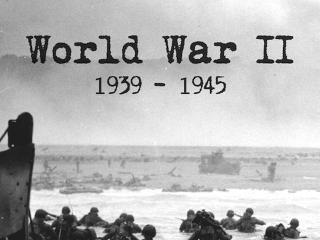

# 2차 세계 대전(World War II) - (1939 ~ 1945)

이 문서는 2차세계대전 관련 다큐멘터리와 교양 강의에 감명받아 작성하게 되었습니다.



# [2차 세계 대전 다큐멘터리](https://www.youtube.com/playlist?list=PLN1COv79fpSAQJCZQMusbVy2KAcxXNSfc)

```
This documentary is dedicated to people sacrificed for World War II for humanity.
- 다큐멘터리의 엔딩 크레딧 中
```

##### 다큐멘터리 성우 - [박상일](https://ko.wikipedia.org/wiki/박상일)

###### **Class 화**를 위해 **주요사건 / 기간 / 내용 / 핵심인물 / 관련연합국 / 관련주축국 / 결과** 위주로 작성해주세요

## 1. 히틀러의 야망(~ 1939)

### 1-1. [독재자의 탄생](./독재자의탄생.md)(\~ 1938)

- 독일, 베르사유 조약 파기 및 재군비 선언(1935)
- 영국-독일 해군조약(1935)
- 제2차 이탈리아-에티오피아 전쟁(1935)
- 독일, **라인란트 재무장**(1936)
- 스페인 내전(1936. 7. 17 ~ 1939. 4. 1)
- **중일전쟁**(1937. 7. 7 ~1945. 8. 15)
- 파나이 호 사건(1937)
- 독일, 오스트리아 병합(1938)
- 하산 호 전투(1938)
- 녹색 작전(1938)
- **뮌헨 협정(1938)**
- 빈 중재(1938)

### 1-2. [나치의 독재](./나치의독재.md)(1939)

- 독일, 체코슬로바키아 병합(1939. 3월)
- 할힌골 전투(1939. 5. 11)
- **독소 불가침조약**(1939. 8. 23)

유럽 동부

- **폴란드 침공(1939. 9. 1)**
  - 브주라 전투
  - 바르샤바 전투
- 겨울전쟁

유럽 서부

- 가짜 전쟁

## 2. [프랑스의 참패](./프랑스의참패.md)(1940)

유럽 서부

- **프랑스 침공(1940. 5. 10 ~ 1940. 6. 25)**
  - 아라스 전차전
  - **다이나모 작전**
- 캐터펄트 작전(1940. 7. 3)
- **영국 본토 항공전(1940. 7. 9)**
- 타란토 공습(1940. 11. 11)

## 3. [홀로코스트의 시작](./홀로코스트의시작.md)(1941)

유럽 서부 / 대서양

- 비스마르크 추격전

유럽 동부

- **바르바로사 작전**(1941. 6. 22)
  - 레닌그라드 포위전
  - 모스크바 공방전
  - 페르시아 침공

태평양

- 남방작전
  - 웨이크 섬 전투
  - 싱가포르 전투(1941. 12. 8 ~ 1942. 2. 15)
    - 말레이 해전
- **진주만 공습(1941. 12. 7)**

## 4. [전쟁의 절정](./전쟁의절정.md)(1942 ~ 1943)

유럽 동부

- 르제프 공방(1942. 1월 ~ 1943. 3. 22)
- 청색 작전
  - 제2차 하르코프 공방전
  - 세바스토폴 공방전
- **스탈린그라드 전투**(1942. 9. 13)

유럽 서부 / 대서양

- 영국 해협 돌파작전(1942. 2. 11 ~ 1942. 2. 13)
- **디에프 상륙작전**(1942. 8. 19)
- 마다가스카르 전투

지중해 / 북아프리카

- 엘 알라메인 전투(1942. 6. 30)
- 횃불 작전(1942. 11. 8)

유럽 북부

- 바렌츠 해 해전(1942. 12. 25 ~ 1943. 1. 9)

태평양

- **미드웨이 해전**(1942. 6. 4 ~ 1942. 6. 7)
- **과달카날 전투**(1942. 8. 7 ~ 1943. 2. 9)

### 1943

카사블랑카 회담(1943. 1. 14 ~ 1943. 1. 26)

유럽 동부

- **쿠르스크 전투**(1943. 7. 5 ~ 1943. 7. 15)

유럽 서부 / 지중해

- 이탈리아 항복

북아프리카

- 튀니지 전투

태평양

- 비스마르크해 해전
- **타라와 전투**(1943. 11. 20 ~ 1943. 11. 23)

## 5. [노르망디 상륙작전](./노르망디상륙작전.md)(1944)

유럽 동부

- 코르순-체르카시 포위전(1944. 1. 24 ~ 1944. 2. 16)
- 카메네츠-포돌츠크 포위전(1944. 3. 22 ~ 1944. 4. 5)
- **바그라티온 작전**(1944. 6. 22)
- **바르샤바 봉기**(1944. 8. 1)
- 부다페스트 공방전

유럽 서부

- **노르망디 상륙작전**(1944. 6. 6)
- 마켓 가든 작전
- 아르덴 대공세

유럽 북부

- 라플란드 전쟁

태평양 / 아시아

- **사이판 전투**(1944. 6. 15)
- **일본 본토 공습** ( ~1945. 8. 15)

기타

- 히틀러 암살 미수사건 및 발키리 작전(1944. 7. 20)

## 6. [전쟁의 끝](./전쟁의끝.md)(1945)

유럽 서부

- **독일 본토 항공전**
- **드레스덴** 폭격(1945. 2. 13 ~ 1945. 2. 15)

유럽 동부

- 베를린 전투
- **베를린 함락**(1945. 5. 2)

태평양

- **이오지마 전투**(1945. 2. 18)
- **도쿄 대공습 (1945. 3. 9 ~ 1945. 3. 10)**
- **오키나와 전투**(1945. 4. 1)
- **히로시마&나가사키 원폭 투하(1945. 8. 6, 1945. 8. 9)**
- **8.15 광복**(1945. 8.15) ****
- **일본 항복 문서 서명**(1945. 9.3)


# 요약

|              **제2차 세계 대전**               |
| :--------------------------------------: |
|  |
|                  **날짜**                  |
|   1939년 9월 1일 \~ 1945년 9월 2일(6년 1일 간)    |
|                  **장소**                  |
|       유럽, 아시아, 아메리카, 대서양, 태평양, 지중해       |
|                  **의의**                  |
| 현 21세기까지도 그 영향력을 끼치고 있는 인류 역사상 최대, 최악의 전쟁 |

| **주요 교전국** | **[연합국](https://ko.wikipedia.org/wiki/연합국)**<br>[미국](https://namu.wiki/w/%EB%AF%B8%EA%B5%AD)<br />[소련](https://namu.wiki/w/%EC%86%8C%EB%A0%A8)<br />[영국](https://namu.wiki/w/%EC%98%81%EA%B5%AD)<br /> [프랑스 제3공화국](https://namu.wiki/w/%ED%94%84%EB%9E%91%EC%8A%A4%20%EC%A0%9C3%EA%B3%B5%ED%99%94%EA%B5%AD)(\~1940)<br /> [자유 프랑스](https://namu.wiki/w/%EC%9E%90%EC%9C%A0%20%ED%94%84%EB%9E%91%EC%8A%A4)(1940\~1944)<br /> [중화민국](https://namu.wiki/w/%EC%A4%91%ED%99%94%EB%AF%BC%EA%B5%AD/%EA%B5%AD%EB%AF%BC%EC%A0%95%EB%B6%80) | **[추축국](https://ko.wikipedia.org/wiki/추축국)**<br />[나치 독일](https://namu.wiki/w/%EB%82%98%EC%B9%98%20%EB%8F%85%EC%9D%BC)<br />[일본](https://namu.wiki/w/%EC%9D%BC%EB%B3%B8%20%EC%A0%9C%EA%B5%AD)<br />[이탈리아 왕국](https://namu.wiki/w/%EC%9D%B4%ED%83%88%EB%A6%AC%EC%95%84%20%EC%99%95%EA%B5%AD)(\~1943)<br />[이탈리아 사회 공화국](https://namu.wiki/w/%EC%9D%B4%ED%83%88%EB%A6%AC%EC%95%84%20%EC%82%AC%ED%9A%8C%20%EA%B3%B5%ED%99%94%EA%B5%AD)(1943\~1945)<br />[헝가리 왕국](https://namu.wiki/w/%ED%97%9D%EA%B0%80%EB%A6%AC%20%EC%99%95%EA%B5%AD) |
| ---------- | ---------------------------------------- | ---------------------------------------- |
| **주요 지휘관** | **미국**<br />[프랭클린 루스벨트](https://namu.wiki/w/%ED%94%84%EB%9E%AD%ED%81%B4%EB%A6%B0%20%EB%A3%A8%EC%8A%A4%EB%B2%A8%ED%8A%B8)<br />→[해리 S. 트루먼](https://namu.wiki/w/%ED%95%B4%EB%A6%AC%20S.%20%ED%8A%B8%EB%A3%A8%EB%A8%BC)<br />**소련**<br />[이오시프 스탈린](https://namu.wiki/w/%EC%9D%B4%EC%98%A4%EC%8B%9C%ED%94%84%20%EC%8A%A4%ED%83%88%EB%A6%B0)<br />**영국**<br />[조지 6세](https://namu.wiki/w/%EC%A1%B0%EC%A7%80%206%EC%84%B8)<br>[네빌 체임벌린](https://namu.wiki/w/%EB%84%A4%EB%B9%8C%20%EC%B2%B4%EC%9E%84%EB%B2%8C%EB%A6%B0)<br />→[윈스턴 처칠](https://namu.wiki/w/%EC%9C%88%EC%8A%A4%ED%84%B4%20%EC%B2%98%EC%B9%A0)<br />→[클레멘트 애틀리](https://namu.wiki/w/%ED%81%B4%EB%A0%88%EB%A9%98%ED%8A%B8%20%EC%95%A0%ED%8B%80%EB%A6%AC)<br />**자유 프랑스**<br />[샤를 드 골](https://namu.wiki/w/%EC%83%A4%EB%A5%BC%20%EB%93%9C%20%EA%B3%A8)<br>**중화민국**<br />[린썬](https://namu.wiki/w/%EB%A6%B0%EC%8D%AC)<br />→[장제스](https://namu.wiki/w/%EC%9E%A5%EC%A0%9C%EC%8A%A4) | **나치 독일**<br />[아돌프 히틀러](https://namu.wiki/w/%EC%95%84%EB%8F%8C%ED%94%84%20%ED%9E%88%ED%8B%80%EB%9F%AC)<br />→[카를 되니츠](https://namu.wiki/w/%EC%B9%B4%EB%A5%BC%20%EB%90%98%EB%8B%88%EC%B8%A0)<br />**일본**<br />[쇼와](https://namu.wiki/w/%EC%87%BC%EC%99%80)<br>[고노에 후미마로](https://namu.wiki/w/%EA%B3%A0%EB%85%B8%EC%97%90%20%ED%9B%84%EB%AF%B8%EB%A7%88%EB%A1%9C)<br />→[도조 히데키](https://namu.wiki/w/%EB%8F%84%EC%A1%B0%20%ED%9E%88%EB%8D%B0%ED%82%A4)<br />→[고이소 구니아키](https://namu.wiki/w/%EA%B3%A0%EC%9D%B4%EC%86%8C%20%EA%B5%AC%EB%8B%88%EC%95%84%ED%82%A4)<br />→[스즈키 간타로](https://namu.wiki/w/%EC%8A%A4%EC%A6%88%ED%82%A4%20%EA%B0%84%ED%83%80%EB%A1%9C) <br /> **이탈리아 왕국**<br /> [비토리오 에마누엘레 3세](https://namu.wiki/w/%EB%B9%84%ED%86%A0%EB%A6%AC%EC%98%A4%20%EC%97%90%EB%A7%88%EB%88%84%EC%97%98%EB%A0%88%203%EC%84%B8) <br />[베니토 무솔리니](https://namu.wiki/w/%EB%B2%A0%EB%8B%88%ED%86%A0%20%EB%AC%B4%EC%86%94%EB%A6%AC%EB%8B%88) <br />**헝가리 왕국**<br />[호르티 미클로시](https://namu.wiki/w/%ED%98%B8%EB%A5%B4%ED%8B%B0%20%EB%AF%B8%ED%81%B4%EB%A1%9C%EC%8B%9C) |

|                  **결과**                  |
| :--------------------------------------: |
|               **연합국의 승리**                |
|                  **영향**                  |
| **20세기 [파시즘](https://namu.wiki/w/파시즘)의 소멸** <br /> **[식](https://namu.wiki/w/대영제국)[민](https://namu.wiki/w/프랑스%20식민제국)[제](https://namu.wiki/w/벨기에%20식민제국)[국](https://namu.wiki/w/네덜란드%20제국)[들](https://namu.wiki/w/일본%20제국)[의](https://namu.wiki/w/이탈리아%20왕국) 몰락** <br /> **[유엔](https://namu.wiki/w/유엔) 창설** <br /> **[냉전](https://namu.wiki/w/냉전)의 시작** |

| **군인 사망자**  | 1,600만 명 이상     | 800만 명 이상   |
| :---------: | --------------- | ----------- |
| **민간인 사망자** | **4,500만 명 이상** | 400만 명 이상   |
|  **총 사망자**  | 6,100만 명 이상     | 1,200만 명 이상 |

## 2차세계대전의 원인

 수 많은 이유가 있으며 학자마다, 사상마다, 정치적 견해마다 그 이유는 전부 다르다. 존 키건의 경우 이런 대규모의 전쟁이 어떻게 가능했는지 보기 위해, 나폴레옹 시절의 유럽 전쟁까지 거슬러 올라가야 했다. 

또한 이 전쟁을 어떤 역사적 맥락에서 보느냐 또한 매우 중요하다. 아래 다양한 주장들을 읽고 스스로 판단하기 바란다.

### 1) 이념 문제

#### a. 민족주의와 파시즘

19C 유럽은 **민족주의**가 **군국주의**, **제국주의**, **사회진화론**과 결합되어 하나의 강력한 사상 체계로서 역할하게 된다. 개인은 민족의 일원으로서 의미를 가지며, 사회진화론이 제시한 약육강식의 세계 체제에 의해 민족은 생존을 위해 끊임없이 강해져야 하는 것이다. 이렇게 민족의 생존과 부흥이 지상과제로 떠올랐으며 이를 위한 수단은 군사력과 영토였다. 광대한 식민지와 거대한 군대는 단순히 한 민족의 영광을 위해서가 아니라 생존을 위한 수단이 되었다. 유럽인들에게 식민지 경쟁은 알짜배기 땅 경쟁이 아니라 각국의 생존을 건 투쟁으로 변모한 것이다.

 1차 세계대전 이후에는 파시즘과 얽히면서 귀족 문화는 배격하고자 했지만 병영 사회만큼은 굳건했다. 참전 군인들의 경험도 이런 문화를 견고하게 했다. 여기에 더해지는 것이 **게르만-슬라브 대립**이다. 흔한 인식과는 달리 사실 나치는 게르만의 진로를 서가 아닌 동으로 잡았다.

#### b. 반유대주의

 유대인들은 유대교를 믿었기에 가톨릭 사회였던 유럽에서는 심한 차별을 받아왔다. 유대인들은 이주 후 고리대금업을 통해 부를 축적하여 유럽에서의 입지가 높아졌다. 고리대금업을 통해 부를 축적한 유대인들에 대한 유럽 일반 대중들의 인식은 결코 좋지 않았고, 그 결과 유럽에 반유대주의 정서가 퍼지게 되었다.

 아돌프 히틀러는 이 점을 이용하여 유대인을 비난하며 아무리 환경을 개선하고 교육을 시켜도 달리질 수 없으니 말끔히 없애야 한다는 주장을 내세워 대중들의 지지를 얻는다. **결과적으로 유럽에서 홀로코스트로 약 6백만명의 유대인이 희생**되게 되었다.

#### c. 반공주의

 1차세계대전 이 후 **소비에트혁명으로 소련이 등장**하면서 독일에서도 공산주의를 꿈 꾸는 사람들이 늘어나기 시작했다. 반유대주의와 마찬가지로 나치는 공산주의자들을 국가전복세력으로 매도해 공포 분위기를 조장함으로써 반공주의를 지지하는 독일 국민들의 표를 얻어냈다. 독일 내 공산주의자들 역시 나치 정권이 들어서면서 유대인들 만큼 심한 탄압을 받게 된다.


### 2) 정치 문제

#### a. 선진 제국주의와 후발 제국주의의 충돌

**영국**, **프랑스** 등의 선진 제국주의 국가와  **독일**, **이탈리아**, **일본**을 위시한 후발 제국주의 국가간의 충돌이 세계대전을 일으켰다는 주장이다. 이미 식민지들은 선진 제국주의 국가들이 깃발을 다 꼽아 놓은지 오래였고, 후발 제국주의 국가들이 살아남으려면 이 식민지들을 뺏어야하는데 이 과정에서 선진 제국주의 국가와의 충돌이 2차 세계대전을 일으켰다는 주장이다. 

대부분의 학자들은 이 것이 유럽국가들이 2차 세계대전을 일으킨 원인이 아니라는 것에 동의하지만, 오히려 일본이 2차 세계대전에 참전하게 된 가장 큰 동기라는 것에 동의하고 있다.

#### b.  베르사유 조약의 불공정함

 1차 세계대전의 결과 독일은 **베르사유 조약**으로 프랑스와 벨기에에 대한 전쟁 배상금으로 **1320억 마르크라는 거금을 강요**하였다. 심지어 베르사유 조약이 체결된 날 기준으로. 당시 독일이 최대 지불 가능한 배상금은 100억 마르크 정도였고, 전쟁으로 국토가 황폐해지고 산업시설이 파괴되어 경제가 피폐화되어 화폐가치는 70%까지 폭락한 상황이라 배상금 지불은 불가능 할 수 밖에 없었다.

 결국 바이마르 공화국은 이러한 불공정함을 바로잡겠다고 나타난 아돌프 히틀러에 의해 나치 독일로 변모되고 베르사유 조약을 파기하고 전쟁을 일으키게 되었다는게 이 주장의 근거.

#### c. 세계 대공황

 전 세계의 경제를 나락으로 빠트린 대공황은 불안하게나마 유지되던 바이마르 공화국을 붕괴시키고 아돌프 히틀러의 나치 독일을 탄생 시키는데 큰 역할을 했다는 주장이다. 

 여기에 베르사유 조약의 막대한 배상금과 프랑스의 경제 위기로 프랑스가 전쟁 배상금의 연체를 명목으로 **독일의 석탄 산지인 루르를 강점**하고 독일의 경제적 위기와 맞물려 프랑스의 독일 영토 강점은 독일 국민들의 자존심에 큰 상처를 입혀 파시즘이 탄생하게 됐다는 것이다. 즉, 1차세계대전으로 맺어진 일방적인 배상금, 영토분할 문제들이 본격적으로 격화되기 시작했을 때 세계대공황이 휘발유를 드럼 통째로 던진 격.

