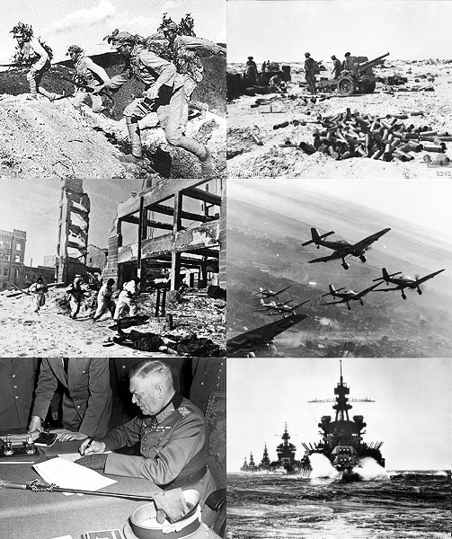

# 2차 세계 대전(World War II) - (1939 ~ 1945)

이 문서는 2차세계대전 관련 다큐멘터리와 교양 강의에 감명받아 작성하게 되었습니다.

[2차 세계 대전 다큐멘터리](https://www.youtube.com/watch?v=SuDWatyl0KY&list=PLN1COv79fpSAQJCZQMusbVy2KAcxXNSfc)

```
This repository is dedicated to people sacrificed for World War II for humanity.
- 다큐멘터리의 엔딩 크레딧 中
```

###### 다큐멘터리 성우 - [박상일](https://ko.wikipedia.org/wiki/박상일)

## 1-1. [히틀러의 야망 - 독재자의 탄생](https://www.youtube.com/watch?v=SuDWatyl0KY&list=PLN1COv79fpSAQJCZQMusbVy2KAcxXNSfc)


- 커피에 커피 외의 다른 물질을 첨가한 커피로, 비엔나커피 등이 있다.


## 1-2. [히틀러의 야망 - 나치의 독재](https://www.youtube.com/watch?v=ixPgeCAJPE4&index=2&list=PLN1COv79fpSAQJCZQMusbVy2KAcxXNSfc)


- 서로 다른 종류(원종, 생산지역, 배전 등)의 원두를 혼합하여 추출한 커피이다.


## 2. [프랑스의 참패](https://www.youtube.com/watch?v=ntpt4dnaM18&list=PLN1COv79fpSAQJCZQMusbVy2KAcxXNSfc&index=3)


- 자메이카의 커피산지 이름에서 유래한 것으로 일반적으로 자메이카산의 커피브랜드 이름으로 신맛과 쓴맛이 잘 조화된 제1급의 커피로 주로 스트레이트용으로 이용된다.


## 3. [홀로코스트](https://www.youtube.com/watch?v=T96aM9vXOns&list=PLN1COv79fpSAQJCZQMusbVy2KAcxXNSfc&index=4)

- 전통적인 네델란드풍의 커피점을 말한다.

## 4. [전쟁의 절정](https://www.youtube.com/watch?v=RnxAtaet8ak&list=PLN1COv79fpSAQJCZQMusbVy2KAcxXNSfc&index=5)


- 전통적인 네델란드풍의 커피점을 말한다.


## 5. [노르망디 상륙작전](https://www.youtube.com/watch?v=yXkoUpw6Dt8&list=PLN1COv79fpSAQJCZQMusbVy2KAcxXNSfc&index=6)


- 에스프레소에 뜨거운 물을 부어 엷게 만든다. 미국에서 많이 마시는 커피와 비슷 하다고 해서 붙은 이름이다.


## 6. [전쟁의 끝](https://www.youtube.com/watch?v=3vTAFowjqwQ&index=7&list=PLN1COv79fpSAQJCZQMusbVy2KAcxXNSfc)


- 아이스 커피의 일종으로 긴 유리잔에 에스프레소를 담고 얼음과 설탕 시럽을 얹어낸다.


# 요약

|              **제2차 세계 대전**               |
| :--------------------------------------: |
|  |
|                  **날짜**                  |
|   1939년 9월 1일 \~ 1945년 9월 2일(6년 1일 간)    |
|                  **장소**                  |
|       유럽, 아시아, 아메리카, 대서양, 태평양, 지중해       |

| **주요 교전국** | **[연합국](https://ko.wikipedia.org/wiki/연합국)**<br>[미국](https://namu.wiki/w/%EB%AF%B8%EA%B5%AD)<br />[소련](https://namu.wiki/w/%EC%86%8C%EB%A0%A8)<br />[영국](https://namu.wiki/w/%EC%98%81%EA%B5%AD)<br /> [프랑스 제3공화국](https://namu.wiki/w/%ED%94%84%EB%9E%91%EC%8A%A4%20%EC%A0%9C3%EA%B3%B5%ED%99%94%EA%B5%AD)(\~1940)<br /> [자유 프랑스](https://namu.wiki/w/%EC%9E%90%EC%9C%A0%20%ED%94%84%EB%9E%91%EC%8A%A4)(1940\~1944)<br /> [중화민국](https://namu.wiki/w/%EC%A4%91%ED%99%94%EB%AF%BC%EA%B5%AD/%EA%B5%AD%EB%AF%BC%EC%A0%95%EB%B6%80) | **[추축국](https://ko.wikipedia.org/wiki/추축국)**<br />[나치 독일](https://namu.wiki/w/%EB%82%98%EC%B9%98%20%EB%8F%85%EC%9D%BC)<br />[일본](https://namu.wiki/w/%EC%9D%BC%EB%B3%B8%20%EC%A0%9C%EA%B5%AD)<br />[이탈리아 왕국](https://namu.wiki/w/%EC%9D%B4%ED%83%88%EB%A6%AC%EC%95%84%20%EC%99%95%EA%B5%AD)(\~1943)<br />[이탈리아 사회 공화국](https://namu.wiki/w/%EC%9D%B4%ED%83%88%EB%A6%AC%EC%95%84%20%EC%82%AC%ED%9A%8C%20%EA%B3%B5%ED%99%94%EA%B5%AD)(1943\~1945)<br />[헝가리 왕국](https://namu.wiki/w/%ED%97%9D%EA%B0%80%EB%A6%AC%20%EC%99%95%EA%B5%AD) |
| ---------- | ---------------------------------------- | ---------------------------------------- |
| **주요 지휘관** | **미국**<br />[프랭클린 루스벨트](https://namu.wiki/w/%ED%94%84%EB%9E%AD%ED%81%B4%EB%A6%B0%20%EB%A3%A8%EC%8A%A4%EB%B2%A8%ED%8A%B8)<br />→[해리 S. 트루먼](https://namu.wiki/w/%ED%95%B4%EB%A6%AC%20S.%20%ED%8A%B8%EB%A3%A8%EB%A8%BC)<br>**소련**<br />[이오시프 스탈린](https://namu.wiki/w/%EC%9D%B4%EC%98%A4%EC%8B%9C%ED%94%84%20%EC%8A%A4%ED%83%88%EB%A6%B0)<br>**영국**<br />[조지 6세](https://namu.wiki/w/%EC%A1%B0%EC%A7%80%206%EC%84%B8)<br>[네빌 체임벌린](https://namu.wiki/w/%EB%84%A4%EB%B9%8C%20%EC%B2%B4%EC%9E%84%EB%B2%8C%EB%A6%B0)<br />→[윈스턴 처칠](https://namu.wiki/w/%EC%9C%88%EC%8A%A4%ED%84%B4%20%EC%B2%98%EC%B9%A0)<br />→[클레멘트 애틀리](https://namu.wiki/w/%ED%81%B4%EB%A0%88%EB%A9%98%ED%8A%B8%20%EC%95%A0%ED%8B%80%EB%A6%AC)<br>**자유 프랑스**<br />[샤를 드 골](https://namu.wiki/w/%EC%83%A4%EB%A5%BC%20%EB%93%9C%20%EA%B3%A8)<br>**중화민국**<br />[린썬](https://namu.wiki/w/%EB%A6%B0%EC%8D%AC)<br />→[장제스](https://namu.wiki/w/%EC%9E%A5%EC%A0%9C%EC%8A%A4) | **나치 독일**<br />[아돌프 히틀러](https://namu.wiki/w/%EC%95%84%EB%8F%8C%ED%94%84%20%ED%9E%88%ED%8B%80%EB%9F%AC)<br />→[카를 되니츠](https://namu.wiki/w/%EC%B9%B4%EB%A5%BC%20%EB%90%98%EB%8B%88%EC%B8%A0)<br>**일본**<br />[쇼와](https://namu.wiki/w/%EC%87%BC%EC%99%80)<br>[고노에 후미마로](https://namu.wiki/w/%EA%B3%A0%EB%85%B8%EC%97%90%20%ED%9B%84%EB%AF%B8%EB%A7%88%EB%A1%9C)<br />→[도조 히데키](https://namu.wiki/w/%EB%8F%84%EC%A1%B0%20%ED%9E%88%EB%8D%B0%ED%82%A4)<br />→[고이소 구니아키](https://namu.wiki/w/%EA%B3%A0%EC%9D%B4%EC%86%8C%20%EA%B5%AC%EB%8B%88%EC%95%84%ED%82%A4)<br />→[스즈키 간타로](https://namu.wiki/w/%EC%8A%A4%EC%A6%88%ED%82%A4%20%EA%B0%84%ED%83%80%EB%A1%9C)<br>**이탈리아 왕국**<br /> [비토리오 에마누엘레 3세](https://namu.wiki/w/%EB%B9%84%ED%86%A0%EB%A6%AC%EC%98%A4%20%EC%97%90%EB%A7%88%EB%88%84%EC%97%98%EB%A0%88%203%EC%84%B8) <br>[베니토 무솔리니](https://namu.wiki/w/%EB%B2%A0%EB%8B%88%ED%86%A0%20%EB%AC%B4%EC%86%94%EB%A6%AC%EB%8B%88) <br>**헝가리 왕국**<br />[호르티 미클로시](https://namu.wiki/w/%ED%98%B8%EB%A5%B4%ED%8B%B0%20%EB%AF%B8%ED%81%B4%EB%A1%9C%EC%8B%9C) |

|                  **결과**                  |
| :--------------------------------------: |
|               **연합국의 승리**                |
|                  **영향**                  |
| **20세기 [파시즘](https://namu.wiki/w/파시즘)의 소멸** <br /> **[식](https://namu.wiki/w/대영제국)[민](https://namu.wiki/w/프랑스%20식민제국)[제](https://namu.wiki/w/벨기에%20식민제국)[국](https://namu.wiki/w/네덜란드%20제국)[들](https://namu.wiki/w/일본%20제국)[의](https://namu.wiki/w/이탈리아%20왕국) 몰락** <br /> **[유엔](https://namu.wiki/w/유엔) 창설** <br /> **[냉전](https://namu.wiki/w/냉전)의 시작** |

| **군인 사망자**  | 1,600만 명 이상 | 800만 명 이상   |
| :---------: | ----------- | ----------- |
| **민간인 사망자** | 4,500만 명 이상 | 400만 명 이상   |
|  **총 사망자**  | 6,100만 명 이상 | 1,200만 명 이상 |

## 2차세계대전의 원인

정말 수많은 이유가 있으며 학자마다, 사상마다, 정치적 견해마다 그 이유는 전부 다르다. 존 키건의 경우 이런 대규모의 전쟁이 어떻게 가능했는지 보기 위해, 나폴레옹 시절의 유럽 전쟁까지 거슬러 올라가야 했다. 

또한 이 전쟁을 어떤 역사적 맥락에서 보느냐 또한 매우 중요하다. 따라서 직접 다양한 주장들을 듣고 스스로 판단하기 바란다.

### 1) 이념 문제

#### a. 민족주의와 파시즘

19C 유럽은 **민족주의**가 **군국주의**, **제국주의**, **사회진화론**과 결합되어 하나의 강력한 사상 체계로서 역할하게 된다. 개인은 민족의 일원으로서 의미를 가지며, 사회진화론이 제시한 약육강식의 세계 체제에 의해 민족은 생존을 위해 끊임없이 강해져야 하는 것이다. 이렇게 민족의 생존과 부흥이 지상과제로 떠올랐으며 이를 위한 수단은 군사력과 영토였다. 광대한 식민지와 거대한 군대는 단순히 한 민족의 영광을 위해서가 아니라 생존을 위한 수단이 되었다. 유럽인들에게 식민지 경쟁은 알짜배기 땅 경쟁이 아니라 각국의 생존을 건 투쟁으로 변모한 것이다.

 특히 독일은 프로이센 시절부터 이어진 군대에 대한 숭상, 귀족들의 적극적 군복무, 프리드리하 대제 등 여러 군사영웅들이 사회문화적 주축이었다. 비스마르크 총리가 이뤄낸 독일 제국은 군사적 승리 위에서 세워졌고, 비스마르크 본인이 어떤 성향이었던 간에 독일 국민들에게 자국 산업과 군대에 대한 신뢰를 갖게 만들었다. 외교적 문제 해결보다는 군사적 해결을 선호하는 경향이 나타난다.

 1차 세계대전 이후에는 파시즘과 얽히면서 귀족 문화는 배격하고자 했지만 병영 사회만큼은 굳건했다. 참전 군인들의 경험도 이런 문화를 견고하게 했다. 여기에 더해지는 것이 **게르만-슬라브 대립**이다. 사실 흔한 인식과는 달리 나치는 게르만의 진로를 서가 아닌 동으로 잡았다.

#### b. 반유대주의

 유대인들은 유대교를 믿었기에 가톨릭 사회였던 유럽에서는 심한 차별을 받았다. 그 과정에서 고리대금업 등에 손을 대게 되었고 이후 많은 돈을 벌어 유럽에서의 입지가 높아졌다. 하지만 일반 대중들은 유럽에 이주해온 이주민들의 이러한 방식으로의 부 축적을 곱게 보지 않았고, 그 결과 유럽에 반유대주의 정서가 퍼지게 되었다.

 아돌프 히틀러는 이 점을 이용하여 유대인은 더럽고 추악한 족속들이라 아무리 환경을 개선하고 교육을 시켜도 달리지지 않으니 말끔히 없애야 한다는 주장을 내세워 대중들의 지지를 얻는데 기여하였다. **결과적으로 유럽에서 약 6백만명의 유대인이 희생**되게 되었다.

#### c. 반공주의

 1차세계대전 이 후 소비에트혁명으로 소련이 등장하면서 독일에서도 공산주의를 꿈 꾸는 사람들이 늘어나기 시작했다. 반유대주의와 마찬가지로 공산주의자들을 국가전복세력으로 매도함으로써 반공주의를 지지하는 독일 국민들의 지지를 이끌어 냈다. 독일 내 공산주의자들 역시 나치 정권이 들어서면서 유대인들 만큼 심한 탄압을 받게 된다.

### 2) 정치 문제

#### a. 선진 제국주의와 후발 제국주의의 충돌

**영국**, **프랑스** 등의 선진 제국주의 국가와  **독일**, **이탈리아**, **일본**을 위시한 후발 제국주의 국가간의 충돌이 세계대전을 일으켰다는 주장이다. 이미 식민지들은 선진 제국주의 국가들이 깃발을 다꼽아놓은지 오래였고 후발 제국주의 국가들이 살아남으려면 이 식민지들을 뺏어야하는데 이 과정에서 선진 제국주의 국가와의 충돌은 필연이었다.

#### b.  베르사유 조약의 불공정함

**베르사유 조약**에서 연합국 지도자들은 프랑스와 벨기에에 대한 전쟁 보상금을 추가로 물라 하여 **1320억 마르크라는 거금을 독일에 배상금으로 강요**하였다. 그것도 베르사유 조약이 체결된 날 기준으로. 당시 독일이 지불할 수 있는 배상금이 최대 100억 마르크였고, 전쟁으로 국토가 피폐해지고 산업시설 가동이 정지되어서 화폐가치가 70%까지 폭락해 배상금 지불은 더욱 힘들어졌다.

 결국 바이마르 공화국대신 나타난 나치 독일의 아돌프 히틀러가 베르사유 조약을 파기하고 전쟁을 일으킬 준비를 했다는게 이 주장의 근거.

#### c. 세계 대공황

 전 세계의 경제를 나락으로 빠트린 대공황은 불안하게나마 유지되던 바이마르 공화국을 붕괴시키고 아돌프 히틀러의 나치 독일을 탄생 시키는데 큰 역할을 했다는 주장이다. 

 여기에 베르사유 조약의 막대한 배상금과 프랑스의 경제 위기 등이 짬뽕되며 **독일의 석탄 산지인 루르에 대한 프랑스의 강점**이라는 결과를 낳은 것이다. 경제적 위기와 프랑스의 독일 영토 강점은 독일인들의 자존심에 큰 상처를 입혔고, 그것이 파시즘으로 이어진 것이다. 1차세계대전 이 후의 문제들이 격화되기 시작했을 때 세계대공황이 휘발유를 드럼 통째로 던진 격.

