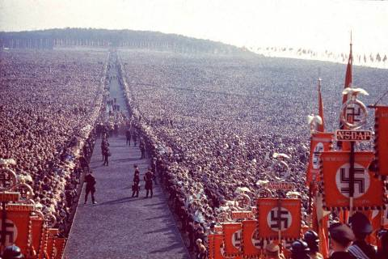

[뒤로가기](https://github.com/GeekInTheClass/WorldWar-II)

# 나치의 독재 - (1939)

# [히틀러의 야망 2편 나치의 독재](https://www.youtube.com/watch?v=ixPgeCAJPE4&list=PLN1COv79fpSAQJCZQMusbVy2KAcxXNSfc&index=2)

## 

**나치 주관으로 진행된 행사 **
*Reichserntedankfest, 1934*

> 1933년부터 1945년까지 유럽에 존재했던 국가. 공식 국명은 1943년까지 Deutsches Reich(도이체스 라이히, 독일국)이었고, 1943년부터는 "'대독일국'"이라는 의미인 Großdeutsches Reich를 썼다. 단, 히틀러는 국가사회주의 독일이라는 명칭도 쓰길 바랐다는데, 이렇게 따지면 나치 독일이라는 명칭이 올바르다! 참고로 위키피디아 영문판에서는 표제어를 Nazi Germany로 하고 있다. 이러한 예를 따라 나무위키에서도 나치 독일이라는 표제어를 채택하였다.
>
> 1933년 수권법을 통과시켜 독재의 기반을 만들고 1934년 파울 폰 힌덴부르크 대통령이 사망하면서 아돌프 히틀러가 총통에 등극하면서 완전한 독재를 성립하게 된다. 1936년 라인란트 재무장으로 자신감을 얻은 나치 독일은 독일어권 지역을 독일의 영토로 포함시키려는 목적으로 1938년 오스트리아 병합을 시작으로 뮌헨 협정으로 주데텐란트를 획득하고 체코슬로바키아를 해체시켰다. 1939년 폴란드 침공으로 제2차 세계대전을 일으키고 이후 노르웨이 침공, 프랑스 침공에서 승승장구하다가 영국 본토 항공전에서 처음으로 목적을 달성하는데 실패한다. 그 후 북아프리카와 발칸 반도를 침공하다가 1941년 독소불가침조약을 파기하고 바르바로사 작전을 개시해 독소전쟁을 일으켰다. 처음에는 전세가 유리하게 돌아갔지만 소련의 반격으로 모스크바를 점령하는데 실패한데다 동맹국인 일본의 진주만 공습으로 미국까지 적국이 되어 전세가 불리하게 되었다. 1942년과 1943년에 걸처 동부전선은 스탈린그라드 전투와 쿠르스크 전투로 결국 수세에 들어섰고 북아프리카 전역은 횃불 작전으로 완전히 패배했으며 시칠리아에 상륙을 허용했고 이탈리아가 연합국으로 전환하여 이탈리아 전선이 생기고 만다. 1944년 서부전선은 노르망디 상륙작전으로 완전히 양면전쟁을 맞이하게 되고 동부전선은 바그라티온 작전으로 중부집단군이 궤멸되고 동유럽 대부분에서 후퇴하게 되었다. 1945년 베를린 전투로 연합군에게 패전하고 베를린이 함락되며 완전히 소멸했다. 패전의 결과로 독일 본토 전체와 오스트리아 또한 점령을 겪었다. 히틀러는 집권할 때 제3제국이 천년 동안 지속하리라고 호기롭게 떠벌렸으나, 겨우 12년 만에 망했다.
>
> "라이히(Reich)"는 흔히 제국이라 번역하지만, 독일어 단어 Reich는 한국어에서 말하는 일반적인 뜻의 제국이 아니다. 차라리 "나라", "영토"의 뜻에 가깝다. 그래서 바이마르 공화국과 나치도 독일 제국 시대의 "도이체스 라이히"라는 국호를 그냥 뒀다.
>
> 제3제국이라고도 부른다. 여기서 '제3'이란 의미는 신성로마제국과 독일 제국에 이은 3번째 단일국가(라이히)라는 의미다. 이 명칭은 독일의 아돌프 히틀러가 1933년 수권법을 만든 뒤 1934년 힌덴부르크 대통령 사망 이후 총통으로서 권력을 장악한 뒤 1939년까지 스스로를 일컬을 때 쓰던 명칭이다.
>
> 흔히 히틀러나 나치당이 "제3제국"이라는 명칭을 썼다고 하지만, 실제로는 연합군의 선동 등을 방지하기 위해 1939년부터 독일 안에서 금지한 명칭이었다.# 하지만 나치도 초기에는 엄연히 쓰던 명칭이고, 역시 연합군도 같은 뜻에서 나치 독일을 가리키는 대명사로 써서 현재 역사서나 전기(戰記), 다큐멘터리 등에서 공식 명칭이 아님에도 널리 쓴다.
>
> 제3제국은 영어권에서도 The Third Reich라고 하며, Reich라는 독일어를 번역 없이 그냥 쓰고 있다. 나치 집권 과정을 직접 겪고 쓴 미국 저널리스트의 윌리엄 샤이러의 명서 '제3제국의 흥망'도 원제는 'The rise and fall of the Third Reich'이다. 그런 뜻에서 "제3제국"이란 표현 역시 "제3라이히"라는 표현이 지지를 받지 않는 한 타당할 수는 있다. 오역이 대중적으로 쓰이고 있는 예라 할 수 있다.
>
> 여담이지만 2006년 국내 내셔널 지오그래픽 채널에서 독일 점령하의 노르웨이에서 어떤 일들이 벌어졌는가 다룬 다큐를 방영했다. 그런데 나레이터가 '히틀러의 Third Reich가 어쩌구...' 하고 말하는 걸 '히틀러의 써드 라이는(...)'이라고 개판으로 자막 처리해 많은 이들의 실소를 자아냈다. 딱히 엄청난 전문지식이 필요하거나 고레벨 밀덕이나 알 만한 명사도 아닌데(...) 차라리 "제3라이히"로 되었으면 맞는 표현이 될 수 있다. 다만 NGC 자체에는 문제가 없고, NGC 작품을 번역하는 아이앤키 미디어의 과실로 보인다.
>
> 동서독 통일 뒤 민족주의적인 일부 독일인들은 이것을 "제4제국의 시작"이라 불렀고, 궁극적으로 독일 민족에 속하는 오스트리아와 스위스를 여기에 참여시켜 독일인의 진정한 제4제국을 세워야 한다고 주장했다. 메트로 2033? 하지만 국제정세를 볼 때 주변 어떤 나라도 이런 "제4제국"을 용인 못할 테니(...) 아시발꿈 실제로 오스트리아는 1955년 재출범 당시 조건이, 독일하고 절대로 통일을 할 수 없다는 것이었다. 세계대전을 독일과 2번이나 같이 치르고 2번 다 폭망했는데 헤어지고 싶을 만도 하지
>
> 그래서 오늘날의 독일은 "통일 독일"이나 "현대 독일"로 불리고 있다. 먼나라 이웃나라의 저자인 이원복에 따르면, '"나치"라는 단어 자체가 현재 독일에서는 욕으로 통한다'고 할 정도다.
>
> 제3제국에 대해 옹호를 하는 사람들은 제3제국의 적이었던 연합국 국가들이 전세계의 식민지들을 착취하고 탄압한 식민제국이라는 점을 들어 식민지 입장에서는 이러한 식민제국과 전쟁을 벌인 제3제국이 흑역사가 아니라는 말을 하기도 하는데, 애초에 제3제국의 근간인 나치즘이란 것이 어떤 사상인지만 안다면 이러한 말이 얼마나 헛소리인지 알 수 있다. 제3제국이 연합군과의 전쟁을 이겼다면 오히려 연합국보다 더하면 더한 사상 최악의 식민제국이 탄생했을 것이기 때문이다.
>
> 나치의 남미 도주 항목을 보면 남아메리카를 비롯해서, 연합국의 식민지였거나 적대적이었던 국가들은 적의 적은 아군 논리로 나치를 그렇게 부정적으로 보지 않는 경향이 있지만, 어디까지나 이들은 미국에 대항할 국가로써 추축국에 우호적이었던 것 뿐이다. 당장 독일군이 소련에 진군했을 당시 스탈린 치하의 소련의 압제와 피우스트스키 치하의 폴란드의 침공을 받았던 과거가 있던 우크라이나, 리투아니아 등을 비롯한 동유럽 소수민족들은 독일군을 폴란드에게 쓴맛을 보여줬고 이제 소련도 혼내줄 해방자라고 환영했지만, 이들에게 돌아온 것은 사람 시체로 이루어진 퇴적층이 생길 정도의 약탈과 학살 뿐이었다. 만약 제3제국이 승리했다면 그와 같은 장면이 전세계적으로 벌어졌을 것이다. 인류 최악의 흑역사라는 것은 괜히 붙은 수식어가 아니다.

