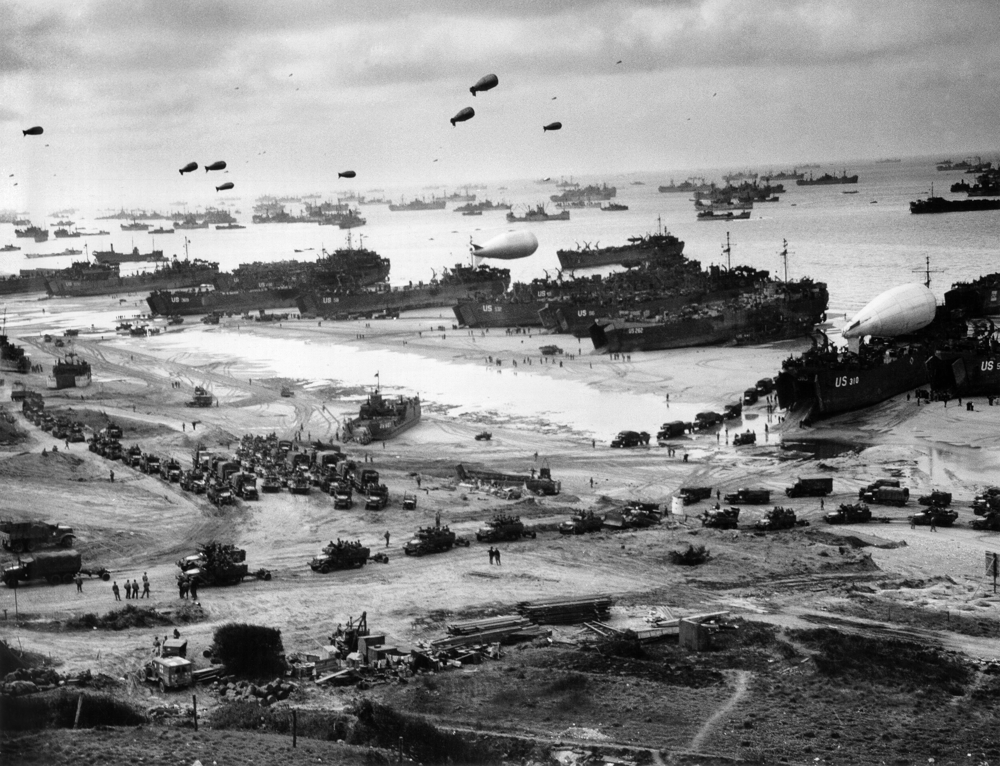

[뒤로가기](https://github.com/GeekInTheClass/WorldWar-II)

# 노르망디 상륙작전 - (1944)

# [노르망디 상륙작전](https://www.youtube.com/watch?v=yXkoUpw6Dt8&index=6&list=PLN1COv79fpSAQJCZQMusbVy2KAcxXNSfc)

## 

**1944년 노르망디에 상륙한 연합군**

\* Normandy, France In 1944