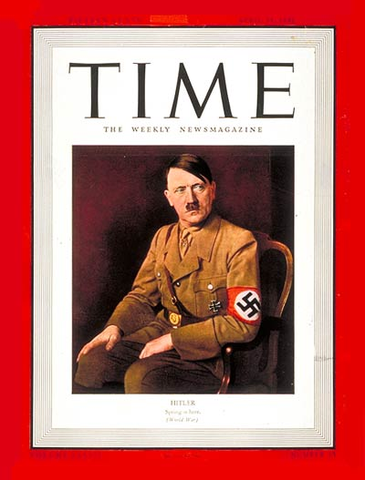

[뒤로가기](https://github.com/GeekInTheClass/WorldWar-II)

# 독재자의 탄생 - (~ 1938)

# [히틀러의 야망 1편 독재자의 탄생](https://www.youtube.com/watch?v=SuDWatyl0KY&list=PLN1COv79fpSAQJCZQMusbVy2KAcxXNSfc)

## 

**1938년 타임지 선정 올해의 인물**

*Time Man of the Year 1938*

> 제2차 세계 대전 추축국 나치 독일의 총통
>
> 히틀러는 오스트리아의 평범한 집안에서 태어난 화가 지망생이었다. 상업 미술가 활동을 하던 히틀러는 1차 세계대전이 일어나자 오스트리아인이지만 독일 제국군에 자원하여 입대하였다. 그러나 1차 세계대전은 독일의 패전으로 끝났고, 이후 일어난 세계 대공황의 영향으로 경제적 파탄 상태에 빠진 바이마르 공화국 하의 독일에서 히틀러는 우연히 나치당에 들어가 정치활동을 시작했는데, 숨겨져 있던 자질인 굉장한 연설과 선전능력이 발휘되어서 그가 들어가기 이전에는 동네 소수정당이였던 나치당을 제1당으로까지 일으켜 세워 정권을 장악하였다. 정권을 장악한 히틀러는 총리직과 새로 얻은 대통령직을 합쳐 제3제국의 총통 자리에 오른다.
>
> 그 뒤 히틀러는 군국주의적 정책을 펼치며 베르사유 조약을 파기하고 군수산업을 확충하며 레벤스라움을 확보한다는 명목으로 주변국을 자극하는 팽창주의 정책을 펼쳤다. 이러한 정책은 전쟁을 피하고자 하는 연합국의 소극적인 반응에 힘입어 오스트리아를 병합하고, 뮌헨 협정으로 체코슬로바키아를 무혈로 독일에 병합하는 등 승승장구했다. 그러나 안일한 생각으로 폴란드를 침공했다가 생각보다 강경한 태도를 보인 연합국의 맞 선전포고를 받아 제2차 세계대전이 발발되게 되었다.
>
> 그런데 후술할 부분을 읽으면 알겠지만 사실 히틀러는 2차 세계대전같은 큰 전쟁을 일으키려고 작정한 것은 아니었다. 히틀러가 상정했던 것은 이전까지의 전쟁처럼 적당한 국지전 정도였으나, 영국과 프랑스가 강경한 대응을 보음으로써 스케일이 매우 크게 확장된 것. 물론 폴란드 침공을 영국과 프랑스가 묵인했다면 폴란드를 점령하고 힘을 더 길러서 영국과 프랑스 쪽에 화살을 돌렸을 확률이 컸지만, 폴란드 침공 당시에 있어서 영/프와의 전면전은 히틀러에게 있어서 완전히 상정 외의 상황이었다.
>
> 전쟁 초기에는 참신한(?) 전술과 연합국의 삽질으로 영국을 제외한 거의 모든 유럽 국가들을 정복하는 등 승승장구했으나, 기껏 얻은 군사적 우위를 독소전쟁 같은 기행에 가까운 전략적 실책과 일본의 실수로 잃어버린다. 그와 동시에 점령지에서도 아리아족 우월주의에 입각한 인종말살 행위를 주도하고 각종 전쟁범죄를 방치하고 조장함으로써 점령지의 민심을 완전히 잃어버렸고, 이런 각종 실책을 벌인 끝에 결국 판도를 완전히 잃고 몰락하여 자살로 생을 마감했다.
>
> 패색이 짙어지기 전에는 독일인들에게 거의 신으로 숭배받는 수준에 이르기도 했다. 그러나 종전 후에는 유럽에서나 전세계적으로도 그와 관련된 모든 것들을 말하는 것조차 금기시되었다. 나치즘에 입각하여 전쟁 중 점령지의 민간인 학살을 명령하는 등 숱한 전쟁 범죄를 일으켰기 때문이다. 또한 홀로코스트같은 인종 학살을 주도했고 T-4 프로그램 같은 장애인 말살 정책을 펴기도 했다.
>
> 남미의 칠레, 아르헨티나는 친독 국가였다. 다만 이들은 부득이한 이유가 있었을 가능성이 높다. 나치의 남미 도주 항목 참조. 중동, 아프리카나 인도 등지에서는 히틀러와 나치에 대해 긍정적이거나 최소한 중립적이다. 일부는 대놓고 히틀러를 옹호하기도 한다. 이들은 영국, 프랑스 같은 서구 열강에게 시달린 역사가 있기 때문이다.
>
> 유럽의 스웨덴이나 핀란드(계속전쟁 당시 나치와 동맹을 맺고 협력했다.), 아이슬란드, 발트 3국 같은 국가도 마찬가지. 스웨덴, 핀란드, 발트 3국 등은 나치독일의 후원자였다. (핀란드, 발트 3국은 소련에게 많이 시달려 부득이하게 나치와 손을 잡았긴 했다) 아이슬란드는 덴마크 왕 크리스티안 10세 때문에 화가 났던 히틀러가 독립시켜줬기 때문이다. 단 발트 3국을 제외하면 이들 나라들은 중립적인 입장을 취하더라도 히틀러를 옹호하거나 긍정적으로 여기진 않는다.
>
> 매우 악랄한 정치노선과는 달리 매우 평범하고 소박한 (?!) 사생활을 가졌기에 의아심을 품게 한다. 어떻게 보면 악의 평범성을 잘 보여주는 사례로 이 점은 도조 히데키와 비슷하며 닮은 부분이 많다. 세계 최초로 동물보호법을 제정한 선구자라는 점은 컬쳐 쇼크 수준. 어쨌든 세계사에 엄청난 영향을 끼친 인물이다.
>
> 서양에서 히틀러 만세-는 철저히 금지된 수사다. 네오나치들은 '히틀러 만세'를 '탄압받는 표현의 자유'라고 주장한다.