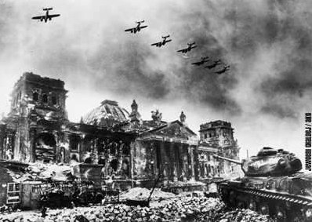
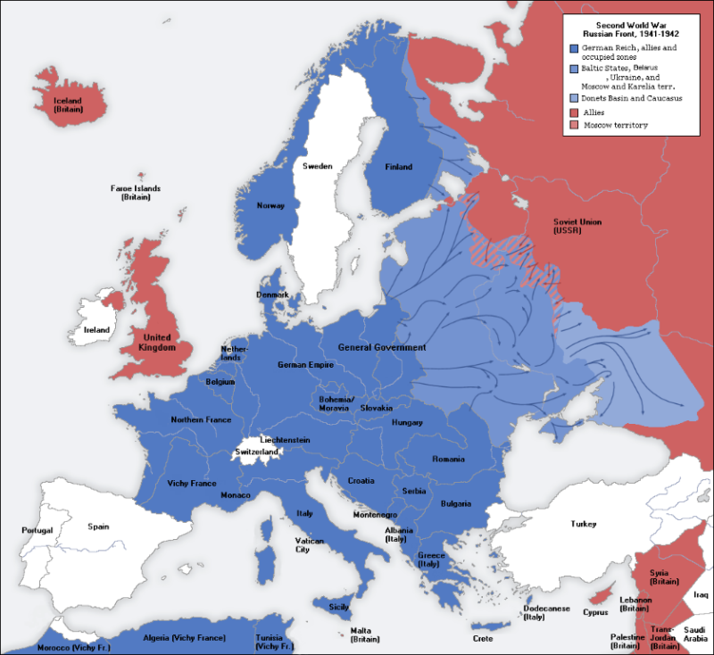
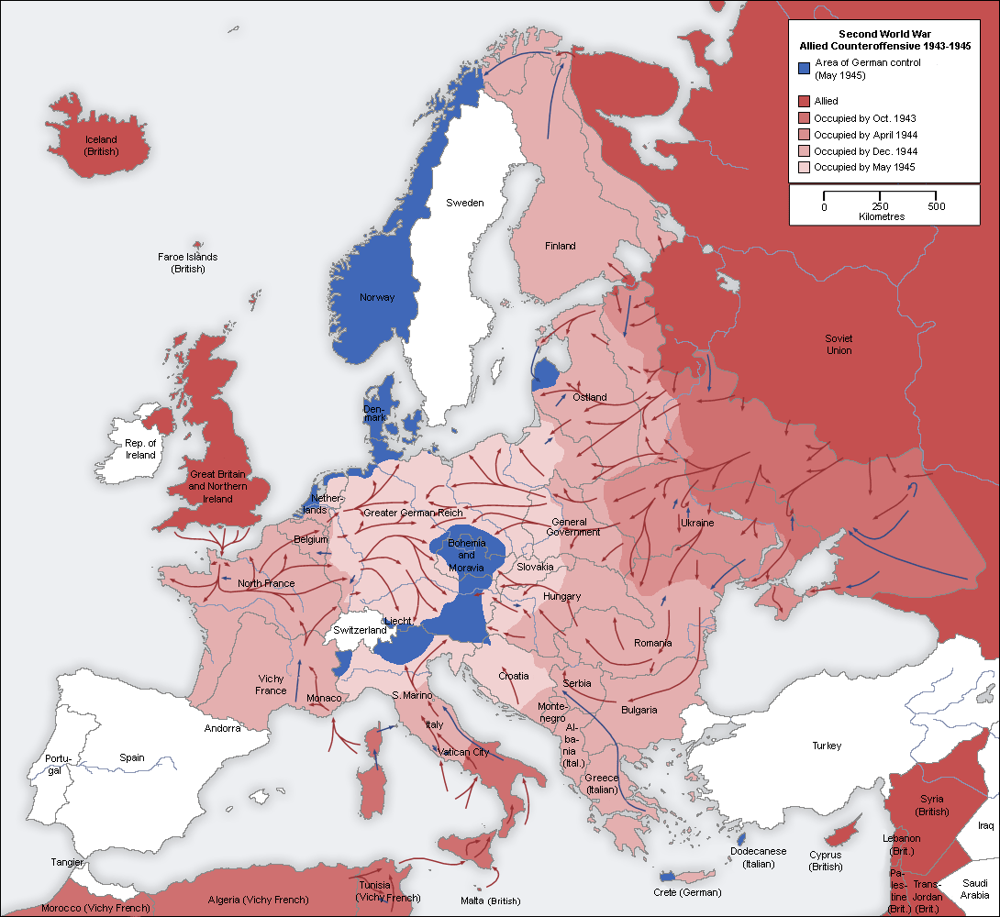
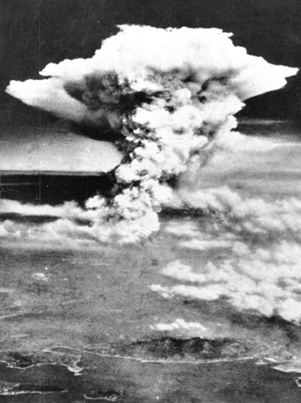
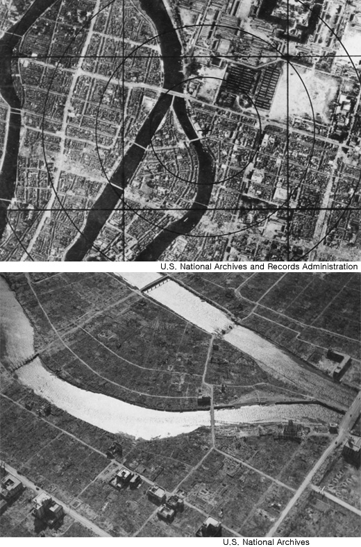
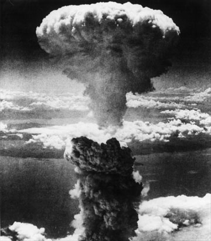
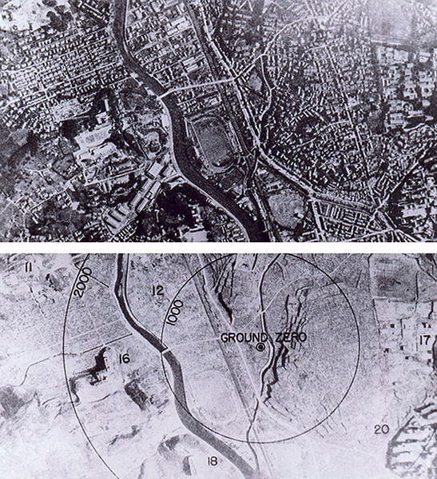
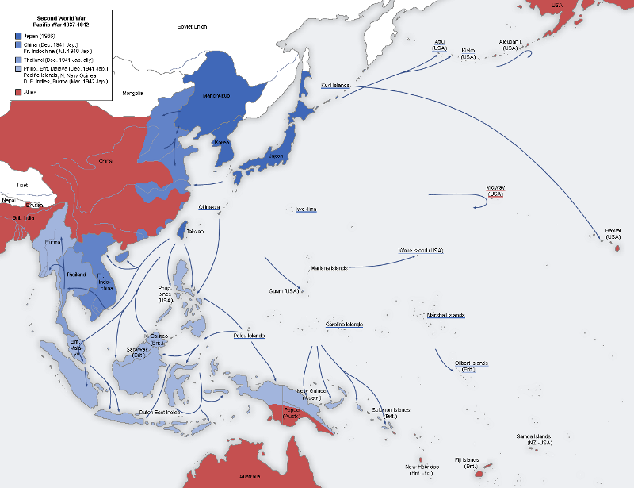
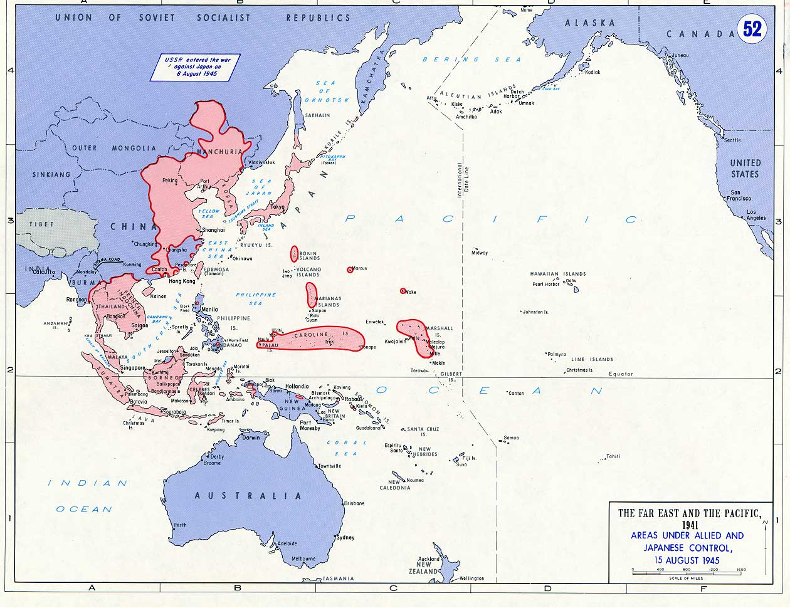
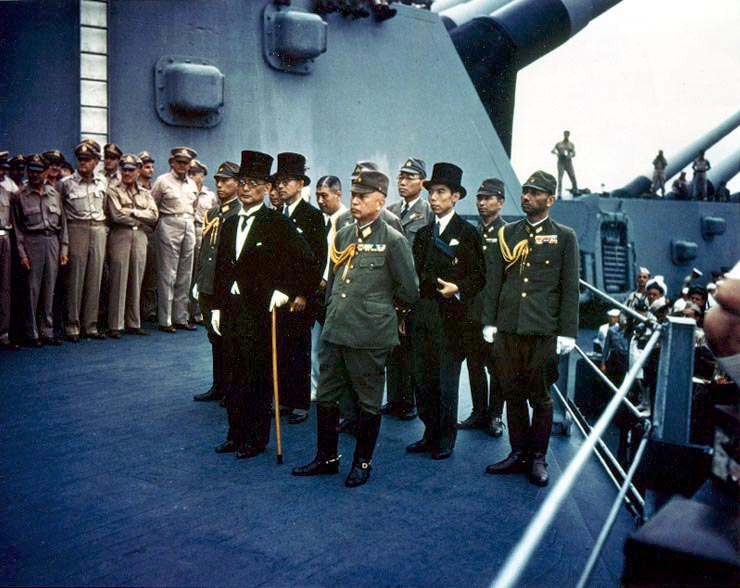

[뒤로가기](https://github.com/GeekInTheClass/WorldWar-II)

# 전쟁의 끝 - (1945)

# [전쟁의 끝](https://www.youtube.com/watch?v=3vTAFowjqwQ&index=7&list=PLN1COv79fpSAQJCZQMusbVy2KAcxXNSfc)

**연합군에 의해 초토화 된 베를린 국회의사당**

*Berlin, Germany In 1945*

**최대 독일 유럽 점령지**

**항복 당시 독일 점령지**

**히로시마에 투하 되는 원자폭탄 리틀보이**

*Hiroshima, Japan In 1945*

**리틀보이 폭발 전후 히로시마**

*Hiroshima, Japan In 1945*

**나가사키에 투하 되는 원자폭탄 팻 맨**

*Nagasaki, Japan In 1945*

**팻 맨 폭발 전후 나가사키**

*Nagasaki, Japan In 1945*

**최대 일본 아시아 점령지**

**항복 당시 일본 점령지**

**항복 문서 조인식에 참석한 일본 대표들**

*USS Missouri In 1942*