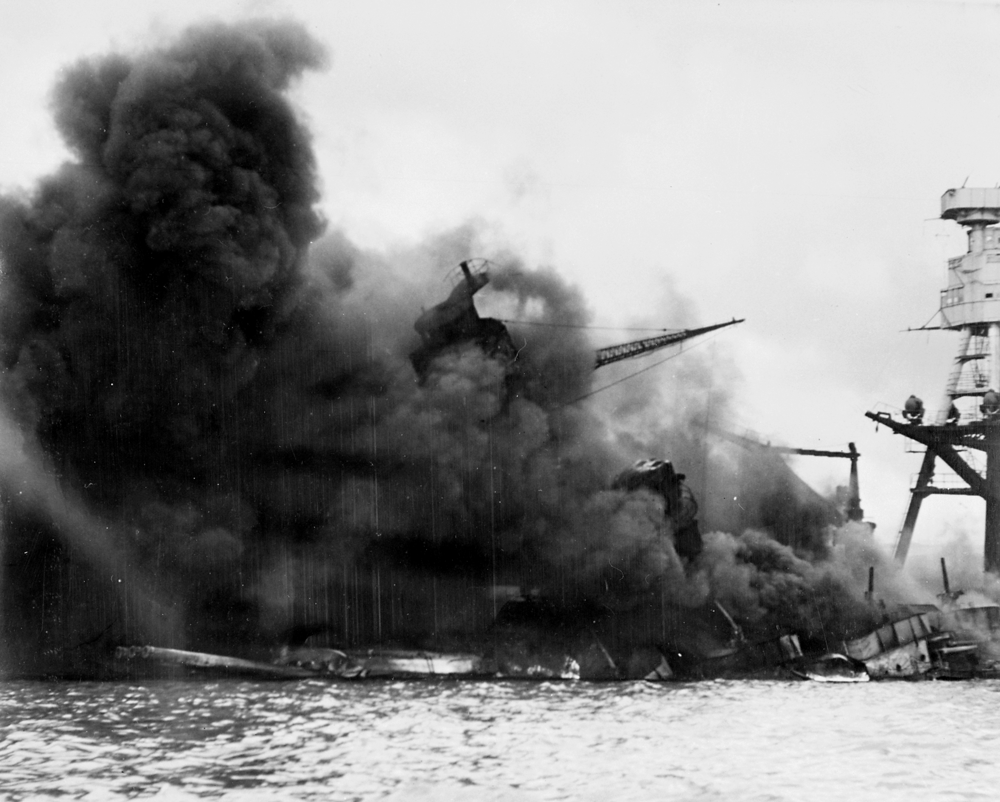
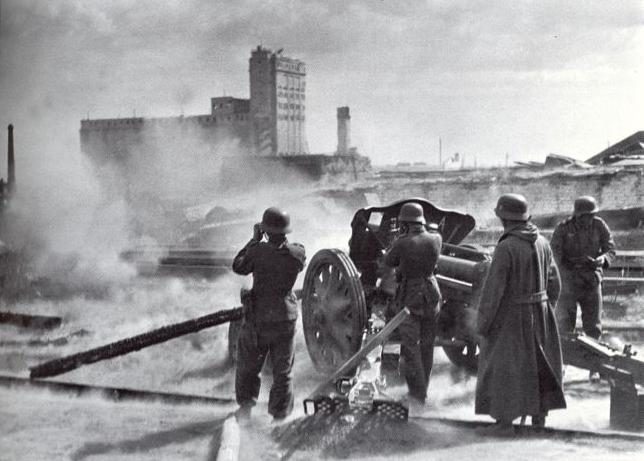

[뒤로가기](https://github.com/GeekInTheClass/WorldWar-II)

# 전쟁의 절정 - (1942 ~ 1943)

# [전쟁의 절정](https://www.youtube.com/watch?v=RnxAtaet8ak&list=PLN1COv79fpSAQJCZQMusbVy2KAcxXNSfc&index=5)

**공습을 받고 화염에 휩싸인 USS 애리조나**

*Pearl Harbor, USA In Dec, 1941*

**스탈린그라드를 포격하는 독일군**

*Stalingrad, Soviet Union In 1942*