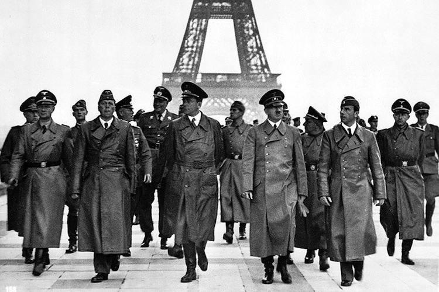
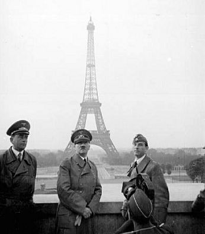
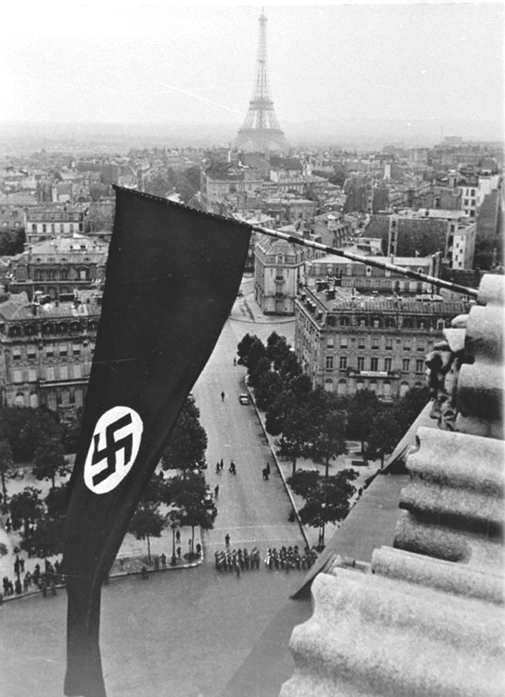
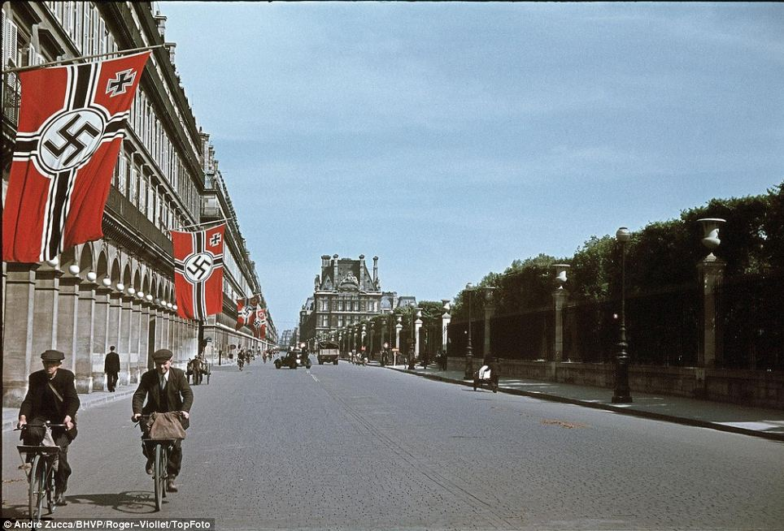

[뒤로가기](https://github.com/GeekInTheClass/WorldWar-II)

# 프랑스의 참패 - (1940)

# [프랑스의 참패](https://www.youtube.com/watch?v=ntpt4dnaM18&list=PLN1COv79fpSAQJCZQMusbVy2KAcxXNSfc&index=3)

## 

**파리에 입성한 나치와 히틀러**

*Paris In 1940*

> 1939년 9월 1일, 아돌프 히틀러가 다스리는 제3제국은 지난 6개월 동안 단치히의 영유권을 두고 외교적 분쟁을 빚은 끝에 결국 폴란드를 군사적으로 침공하였다. 당시 히틀러는 이 전쟁을 일종의 무력시위, 단순한 퍼레이드 정도로 여겼다. 그 이유는 아래에서 서술되는 내용을 보면 알겠지만, 당시 독일은 프랑스에 비해 병력의 규모 및 훈련도, 장비의 양과 질, 군수보급체계 등 뭐 하나 우위를 점한게 없었다. 영국/프랑스와의 본격적인 전쟁은 꿈도 못 꾸는 상황이었다. 히틀러와 독일 수뇌부는 해군의 Z계획 등 군사력 증강과 군수공업 시설 건설이 완료되는 1945년경을 본격적인 프랑스 침공 시점으로 예상하고 있었다. 실제 독일의 무기생산은 제공권 상실로 연합군의 엄청난 폭격에 시달리면서도 1944년 가을에 최고점을 찍는다. 1930년대 후반부터 건설하기 시작한 군수공업시설이 그때야 제대로 돌아가기 시작한 것이다. 이런 상황이니 1939년 폴란드 침공은 본격적인 세계대전 개전이 아니라 체코 병합과 같은 무력시위 성격의 계획이었다.
>
> 히틀러는 폴란드와는 제대로 된 전쟁을 치르겠지만 1939년 3월 체코의 완전 합병 이후 군비증강 및 대독 적대정책을 본격적으로 펼치기 시작한 영국 및 프랑스가 이 무력시위에 깜짝 놀라 그 동안의 적대정책을 버리고 독일의 패권을 인정하게 될 것이라고 믿었다. 또한 이런 논리로 군부 및 정치, 경제계를 안심시켰다. 그리고 독일에서는 회의적인 입장의 사람들이라도 제발 그렇게 되길 간절하게 빌었다. 당연한 이야기지만, 그렇게 안 됐다간 독일이 망할지도 모르는 위기였다. 특히 반히틀러 입장의 군인들이 더 그랬는데, 당시 독일군은 양면전쟁은 절대 하지 마라. 했다간 반드시 패전한다라고 생각하고 있었다. 그리고 1939년 9월 3일부로 독일은 양면전쟁을 시작했다(…). 사실 히틀러도 양면전쟁의 말로를 잘 알고 있어서 소련과 독소 불가침조약을 맺었지만... 이때는 반 히틀러 진영조차 정말 두손두발 다 모아 히틀러의 말이 현실이 되거나, 아니면 그가 한시라도 빨리 제정신을 차리기를 기도하는 형편이었다.
>
> 그러나 영국과 프랑스는 1938년 초에는 오스트리아 문제로 한 방 먹었고, 그해 가을에는 체코슬로바키아 문제로 또 한 방 먹었으며, 덤으로 1939년 초에는 슬로바키아의 분리독립과 체코의 완전 합병으로 최후의 일격을 먹은 상태였다. 따라서 이미 영국과 프랑스는 아무리 늦어도 1939년 초, 빠르게 보면 1938년 가을 시점에서 머지않아 독일과 일전을 치르지 않을 수 없다고 믿었고, 이에 가능하면 자기들이 직접 군대를 보내지 않고도 독일과 싸워 이길 수 있을 만한 강력한 동맹국을 찾고 있었다. 그 동맹국으로 뽑힌 것이 폴란드였다. 당시 폴란드는 독립 직후의 혼란기에 소련을 침공해서 승리를 거둔 역사도 있었기 때문에 중부 유럽의 군사강국처럼 보였다. 이 때문에 폴란드와 군사동맹을 맺으면서 당시 네빌 체임벌린 영국 수상은 폴란드를 가리켜 "그 강력한 나라"라고 일컬을 정도였다. 하지만 폴란드 주재의 영국-프랑스 무관들은 폴란드의 한심한 군사적 실상을 정확히 파악하고 있었고, 폴란드군은 모래로 만든 성 또는 외화내빈이라고 본국에 보고했다. 특히 공군이나 기갑부대의 전력은 절망적이었고, 육군의 기계화는 미진하기 그지없는데다 공군은 고작 200여대의 전투기를 보유했으며 그나마 복엽기가 대부분이었다. 통신이나 수송 또한 매우 전근대적이었다. 그러나 영-프 정치가들은 친서방적인 폴란드 체제에 일종의 환상을 가지고 있었으며, 이 때문에 반소적인 폴란드 정부의 눈치를 보아 소련과의 동맹에 매우 소극적으로 나왔다.
>
> 소련의 막심 리트비노프 외교부 장관은 는 영-프-폴-소로 이뤄진 독일 포위망을 구성하려 했으나, 소련과의 역사적으로 악연이 있던 폴란드는 소련과의 협력을 막무가내로 거부했다. 그러자 영프는 폴란드의 눈치를 봐서 소련과의 동맹을 주저했고, 소련이 제안한 집단안보체제에 건성으로 반응했다. 스탈린은 애써 회담장을 마련했는데, 영-프 협상단이 무성의로 일관하자 격노했고, 특히 독일이 주변국을 침략할 경우 소련은 100여개사단을 동원하여 막겠다고 하며 이에 대해 영국은 몇개 사단을 내놓을 수 있냐고 묻자, 영국이 파견할 수 있는 지상군이 불과 4개 사단이란 걸 듣고는 아연실색했다. 나중에 스탈린이 구체적인 자료를 요구하자 자료를 내놓았는데, 알고보니 그 중에서 즉각 파견이 가능한 사단은 2개사단이었다. 애시당초 회담장에서 보로실로프는 당장에 어떠한 문서에도 서명할 수 있도록 스탈린으로부터 전권을 위임받았다는 위임장을 내보였고, 당시 소련의 최고지휘관 전부가 회담장에 와있었다. 프랑스 대표는 자신의 위임장을 내보였고 상당한 수의 병력지원을 약속했지만, 영국 대표는 전권위임은 커녕, 어떠한 사항에도 동의할 권한이 없었다. 이에 스탈린은 이들은 소련과 독일을 싸움 붙인 후에 어부지리를 기대하는거 아닌가 하고 의심하기 시작했다. 결국 그는 영-프와의 협상이 결렬되자 반독일적인 리트비노프를 해임하여 독일에 화해의 제스처를 보냈고, 이를 감지한 독일은 외상 리벤트로프를 보내 독소 불가침조약을 맺기에 이른다. 이러한 외교는 나중에 서방측에게 치명적인 실수가 되었다. 
>
> 어찌되었든 폴란드를 동맹국으로 만든 영국과 프랑스는 역시 당시의 독일과 마찬가지로 우리가 큰 소리로 어흥하고 고함치면 폴란드가 기가 팍 살아서 독일의 뺨을 제대로 한 방 갈길 것이고, 그럼 독일은 깨갱하고 꼬리를 내릴지도 모른다고 기대하고 있었다. 그래서 결국 영국과 프랑스는 9월 3일 정오 독일에 앞으로 5시간 내에 폴란드 침공을 중지하거나 침공을 중지하겠다는 확실한 보장을 하지 않으면 선전포고를 하겠다는 최후통첩을 하기에 이르렀다. 이 시점에서 히틀러 및 제3제국 수뇌부의 반응은 이랬다.
>
> > **내가 통역을 마치자 그곳은 침묵으로 휩싸였고...(중략)...히틀러는 돌처럼 굳은 채 가만히 전방을 바라보았다. 훗날 알려진 것처럼 흥분하거나 미쳐 날뛰지 않았다. 그는 자신의 의자에 미동도 없이 조용히 앉아 있었다. 영원처럼 느껴진 잠깐 동안의 정적이 흐른 뒤, 갑자기 히틀러는 창백한 모습으로 창가에 서 있던 외무장관 리벤트로프를 분노에 찬 눈빛으로 노려보며 이렇게 물었다.**
> > **"이제 어떻게 할 건가?"**
> > **마치 리벤트로프가 영국의 반응을 잘못 알렸다고 지적하고 싶어하는 것 같았다. 리벤트로프는 목멘 목소리로 이렇게 대답했다.**
> > **"아마 프랑스도 머지않아 우리에게 동일한 내용의 최후통첩을 보낼 것 같습니다."(…)**
> > **괴링은 나를 돌아보며 이렇게 말했다.**
> > **"이번 전쟁에서 또다시 패배한다면 과연 신은 우리에게 자비를 베풀어 주실까?"**
> > **- 히틀러의 통역실장 파울 슈미트의 회고 -**
> > (출처 : 칼 하인츠 프리저 저 "[전격전의 전설](https://namu.wiki/w/%EC%A0%84%EA%B2%A9%EC%A0%84%EC%9D%98%20%EC%A0%84%EC%84%A4)(Blitzkrieg-Legende)" 2-1장)
>
> 사실 이런 상황은 이미 독일 국내에서도 매우 가능성 높은 시나리오로 여겨지고 있었다. 이 때문에 폴란드 침공을 전후해서 군부에서의 반 히틀러 움직임이 본격화되기 시작했으며, 이런 군부의 불만을 억누르기 위해 히틀러는 반복적으로 폴란드 침공과 관련해서 서방세계, 특히 영국을 자극하지 않을 것임을 군부에게 반복적으로 다짐해 왔었다. 심지어 히틀러의 정책을 성실히 따르면서 만약의 사태에 대비해서 대영/대프랑스 방어전을 계획하던 참모본부 참모장교들에게 히틀러가 "님들 그러다가 영국이나 프랑스가 그거 알면 걔네들이 그거 핑계로 쳐들어올지도 모른다고! 그거 님들이 책임질거임?"이라면서 펄펄 뛰기까지 했을 정도였다. 그래서 저런 상황이 마침내 현실로 다가오자 전 독일이 데꿀멍 모드로 들어가고 말았다.
>
> 그러나 이미 물은 엎질러졌고, 히틀러로서는 이미 엎지른 물을 주워담을 길이 없었다. 히틀러는 현대 역사가의 눈으로 보면 말 그대로 벼랑끝 전술, 배째라 전술을 구사해서 극적으로 주변국의 양보를 이끌어내는 도박사적 행위로 자신의 인기를 유지해 왔으나, 당시 독일 국민들은 그런 히틀러의 배째라 정신을 강력한 영도력과 탁월한 정치적-군사적 식견에 힘입은, 적어도 서너 수는 미래를 내다보는 철저한 전략의 결과물이라고 믿었다. 이것을 조장한 것이 히틀러와 나치당, 정확하게는 괴벨스로 대표되는 당시 나치독일의 선전부서였기 때문에, 이제 와서 그동안 한껏 부풀려놓은 히틀러의 위대한 식견을 함부로 깔아뭉갤 수는 없었다. 그랬다가 벌어질 일은 히틀러의 실각 밖에 없었기 때문이다. 
>
> 더군다나 이미 양면전쟁이 확실시되고 프랑스가 9월 7일부터 16일까지 1차로 11개 사단, 최종적으로는 총 41개 사단을 휘몰아 자를란트로 30km나 밀고 들어온 상황이었다. 사실 프랑스군도 상황은 엉망이어서 자르로 진격하는 임무에 동원된 41개 사단 중에서 제대로 완편된 사단은 고작 3개에 불과했지만, 프랑스군에 맞선 독일 제1군 예하 사단들은 아직 편성이 제대로 되지도 않아서 중장비는 전혀 없는 말 그대로 총만 든(경우에 따라선 소총도 없는) 군중에 불과했다. 군복조차 조달되지 않아 소총도 없이 집에서 들고 온 삽을 하나 메고 독일 국방군이라고 스탬프를 찍은 완장(...)만 찬 병사들마저 만 명 단위로 있었을 정도. 당연히 이들은 프랑스군 침공에 대해 직접적인 저항은 거의 하지 않고, 단지 도시와 마을을 소개하고 주요 길목에 막대한 양의 지뢰를 매설했을 뿐이다. 하지만 그렇다고 해서 그런 프랑스의 군사적 압력에 무력하게 굴복할 수는 없었다. 더구나 9월 16일을 기해 프랑스가 전면 동원령을 발령함에 따라 이제 절대로 전쟁은 피할 수 없어 보였다.
>
> 그나마 히틀러에게는 다행스럽게도 자르를 침공한 프랑스군은 9월 17일을 기해 철수를 시작, 마지노 선 서쪽의 원래 주둔지로 돌아가 버렸으므로 히틀러에게는 기회가 다시 주어졌다. 폴란드와의 전쟁을 서둘러 끝낸 다음 프랑스를 격파할 기회가 주어진 것이다. 그리하여 결국 폴란드 점령이 완료된 직후인 1939년 10월 9일을 기해 히틀러는 총통지령 6호(Führer-Anweisung N°6)를 발령, 프랑스 침공 계획을 공식화했다.
>
> 물론 아직 확정된 것은 아무 것도 없었다. 독일만 그런 게 아니라, 영국과 프랑스도 그랬다(…).
>
> 1939년 10월 폴란드 전토가 독일과 소련에게 분할 점령되고, 개전 직전에 있었던 독소 불가침조약 체결로 독일은 일단 양면전쟁 상황은 간신히 피할 수 있게 되었다. 그러나 독일은 현재 총병력 450만 중 실제 전투력을 가진 병력이 200만을 넘지 않는 상태에서, 해외 주둔군을 포함해서 정규군만 200만이고 단기간에 3~400만 이상을 추가 동원할 수 있다고 여겨지는 프랑스를 상대로 어떻게 싸워야 할지 전혀 감을 잡지 못한 상태였다.
>
> 그리고 이 단계에서 히틀러는 어차피 빠른 시간 내에 병력을 충분히 늘릴 수도 없는 지금, 아직 프랑스가 동원을 마치기 전에 서둘러서 먼저 치고 보는 게 낫다며 10월 중, 늦어도 11월 말 침공을 군부에 명령함으로서 독일 국방군 참모본부를 대 패닉에 빠트렸다. 하지만 소가 뒷걸음질 치다가 쥐를 잡듯이 히틀러의 생각도 일리는 있었다. 이는 프랑스의 동원체계는 상당히 굼뜬 편이어서, 소집된 예비군이 전투부대로서 편성되는 데는 수 개월이 필요했기 때문이다. 그렇게 생각하면 1939년 11월 시점에서 독일군과 프랑스군이 전장에 투입 가능한 정규군 및 소집완료 예비군 병력합계 자체는 200만 대 200만으로 서로 거의 같았다. 다만 프랑스에게는 군복무를 마친 예비군 400만 명과 해외주둔군 150만 명이 더 있었고, 독일에게는 훈련되지 않고 총도 없는 소집대상 민간인 500만 명만 있었다.(...) 즉, 제1차 세계대전 식으로 생각하면 첫 한 방에 프랑스를 집어먹지 못하면 다음에 먹히는 건 독일이었다. 하지만 독일군도 제대로 편제가 완성된 것이 아니라서 서로 준비없이 양군이 충돌하면 독일군이 발릴 가능성도 높았다는 것이 문제였다.
>
> 그래서 독일 군부는 필사적으로 히틀러를 설득, 그나마 그해 겨울 동안은 침공하지 않을 수 있었다. 가짜 전쟁의 소강 상태는 바로 이런 독일 수뇌부의 판단에 따라 독일이 설설 기었으며, 아울러 프랑스 및 영국 역시 아직 병력 동원이 충분치 않은 상태에서, 가능한 한 독일의 선공으로 전쟁이 시작되어 소모전을 유도, 독일이 지친 다음에야 공세로 나가는 1차 세계대전식 전략을 채택하고 있었기 때문에 가능했던 일이었다. 그리고 이 기간 동안 독일은 아직도 제대로 가동되지 않고 있던 군수산업 가동율을 높여 부족한 장비와 탄약을 보충했다. 당장 폴란드 전역이 종결된 시점에서 독일 국방군이 보유한 탄약은 전군에 필요한 기본 예비탄약의 30~50% 미만이었다. 당시 기본 예비탄약은 전투 2~3회를 치르는 탄약이었으므로, 사실상 전군이 딱 한 번 싸우면 끝나는 탄약 밖에 없었다. 여기에 더해서 폴란드 침공 당시 소모한 각종 기갑, 기계화장비를 보충하는 귀중한 기회를 얻었다.
>
> 이 기간 동안 독일 국방군 참모본부는 히틀러가 총통지령으로 하달한 프랑스 침공을 현실화시키기 위한 작전계획을 수립하기 시작했다. 하지만 개전 전까지만 해도 프랑스로 쳐들어가면 우리는 망한다는 위기감에 사로잡혀 있던 참모본부는 가능하면 프랑스 침공 없이 전쟁이 끝나기를 원했고, 이 때문에 1939년 10월부터 다음해 1월까지 제출된 대 프랑스 작전계획은 허술하기 그지없는 것이었다. 어린애가 봐도 실패할 게 뻔해 보이는 작전계획 이상의 작전안을 만들지 못한다면, 히틀러도 전쟁을 포기하지 않을까 하는 기대가 섞인 일종의 태업이라는 견해도 있을 정도다.
>
> 그런데도 히틀러는 정 안 되면 이대로라도 치고 나가겠다는 주장을 걸핏하면 밝혔고, 이 때문에 참모본부, 특히 참모총장이었던 프란츠 할더 상급대장은 히틀러를 내가 직접 쏴죽여야 하지 않을까 하고 생각할 정도까지 몰렸다. 원래 할더는 1938년부터 히틀러에 대해 저항했으며, 1939년 11월에는 실제로 쿠데타 직전까지 갔다. 그러나 할더 본인의 소심함과 더불어 순간적인 판단착오로 쿠데타 계획은 무산되었다. 이때의 쿠데타 멤버 중에 훗날 히틀러 암살 미수사건 당시 프랑스에서의 사태를 주도한 슈퇼프나겔 장군이 있었고, 할더도 히틀러 암살 미수사건 이후 이 1939년의 반란 기도가 발각되어 체포되었다가 구사일생으로 살아남았다. 당연하게도 할더는 말로 끝내지 않고 나름대로 준비도 진행했는데, 한스 그로스쿠르트 대령도 이런 암살음모모의에 가담한 사람 중 하나였다. 이 무렵 할더에게 히틀러를 폭탄으로 암살할 전문가를 알선하라는 비공식 명령도 받은 적이 있었다. 그리고 이때의 폭탄테러 계획은 훗날 히틀러 암살 미수사건에서 현실화되었다. 그로스쿠르트 대령은 스탈린그라드 전투에서 포로가 되어 1943년에 수용소에서 죽었지만, 그가 남긴 일기장에는 이런 대목이 적혔을 정도다.
>
> 이러는 동안에도 시간은 점점 흘러갔고, 사태를 평화적으로 해결할 희망은 이미 1939년 10월 이후 끝장이 나 있었다. 이제 전쟁은 피할 수 없게 됐고, 반 히틀러 진영마저 결국 이렇게 된 바에는 어떻게든 이겨 볼 수 밖에 없다는 데까지 생각이 미쳤다. 히틀러를 제거한다면 그 뒤에나 할 수 있는 일이었고, 일단은 이기지 않으면 안 된다는 것이다. 
>
> 그러나 아직도 독일군은, 적어도 참모본부 차원에서는 뭘 어떻게 해야 할지 전혀 감을 못 잡고 있었다. 당장 프랑스 침공에 투입할 부대는 어느 정도 윤곽이 드러나고 있었지만, 그것을 어떻게 써야 할까에 대해서는 계속 우왕좌왕중이었던 것이다.
>
> 그리고 할더가 그렇게 전전긍긍하고 있을 동안, 1939년 10월에 작성된 프랑스 침공작전 초기안에서 조공부대로 결정된 A집단군(Heersgruppe A)의 참모장이었던 어떤 인물이 누구든지 보기만 해도 "이놈 미쳤군!"이라고 외칠 만한 기상천외하고 위험한 작전계획을 수립, 제출했다.
>
> 그의 이름은 **에리히 폰 만슈타인**이었다. 이 후 전쟁은 영상 속에서 자세히 설명되는 대로 프랑스의 완패로 파리가 독일군이 파리에 입성하게 되면서 프랑스는 독일에 패하게 된다.
>
> 
> **프랑스 혁명의 도시의 함락**
> 
> **파리에 걸려 있는 나치의 깃발들**
>
> > "저는 모든 적대 행위를 중단하라고 적에게 요청했습니다. 군인으로써 이런 가슴 아픈 결정을 내린 것은 군의 상황이 어쩔 수 없기 때문입니다."
> >
> > - 앙리 필리프 페탱, 항복할 당시 연설에서
>
> 독일 방송은 항복 연설을 독일어로 번역하여 라디오로 내보냈고 이 항복 연설을 들은 전 독일인들과 독일 병사들은 환호했다. 그리고 히틀러는 모스크바로부터 스탈린이 보낸 축하 전보를 받았다.
>
> 6월 17일, 신임 프랑스 수상 앙리 필리프 페탱은 독일에게 휴전을 제의했고, **6월 22일 정전 협정이 체결**되었다. 정전 협정 체결 직전인 21일 뒤늦게 이탈리아군이 참전하긴 했지만, 역시나 신나게 얻어맞고 극히 작은 영토 확장을 달성하는 데 성공했을 뿐이었다. 6월 24일 로마에서 이탈리아-프랑스 사이의 휴전 협정이 체결되었고, 6월 25일 새벽 1시 35분을 기해 최종적으로 정전이 이루어지며, **비시 프랑스** 정부가 수립되었다.
>
> **1940년 6월 22일**에 히틀러는 파리 근교에 도착했고 프랑스에 역사적인 수치를 안겨줄 장면이 연출되었다, 1918년 제1차 세계대전에게 독일에게 굴욕을 안겨주었던 당시 항복문서가 체결된 열차를 가지고 왔다. 그의 복수는 완벽했다. 프랑스에서는 욍치체르 장군이 대표로 왔고. 독일 통역관이 프랑스가 이유없이 독일에게 전쟁을 선포했다는 내용의 비판 내용을 이야기했고, 이 비판이 끝난 직후 히틀러는 한마디도 하지 않고 열차에서 내렸다. 프랑스 대표단에게는 휴전 조건이 제시되었는데 그 중 한가지 조건은 프랑스로 도피해온 반나치 독일인들을 모두 넘겨준다는 것이었다. 헌징거가 협상을 해보려 시도했지만 독일은 거절했고 그렇게 아무런 소득도 없이 협상은 끝나버렸다. 제1차 세계대전에서 패배한 독일의 항복 사절단이 타고 온 열차의 객차를 프랑스에서 그대로 보관하고 있었기 때문에, 독일은 프랑스의 항복 조인식을 이 객차 안에서 진행했다. 조인식이 끝난 후 히틀러는 이 열차를 베를린으로 가져갔는데, 이 열차는 독일이 점점 패망해가기 시작하자 히틀러가 게슈타포에게 명령하여 이 열차를 다이너마이트로 폭파시켜버렸다.
>
>  제1차 세계대전에서 프랑스의 승리를 상징했던 기념물들은 모두 조롱거리가 되어버린다. 히틀러와 병사들은 막 점령한 마지노 선을 보며 프랑스를 비웃는다**. 프랑스 침공으로 얻은 전리품은 탱크 2천대, 대포 5천문, 소총 30만 점과 4백만발에 달하는 총알을 얻게 되었고 또한 프랑스군에게 제공되려고 했던 속옷들은 독일이 나중에 벌이게 될 전투를 위해서 전부 독일군이 가져가 버렸다. 프랑스군의 총기들은 압류당하여 모두 독일군의 손에 쥐어졌으며 얼마전까지 조국 프랑스를 지키던 르노 FT-17, 소뮤아 S-35등의 기갑차량들과 기갑열차, 대포들은 하켄크로이츠가 흉하게 칠해진 채 나치의 침략을 위한 무기로 쓰여졌다. 프랑스의 모든 공장과 항구, 그리고 모든 프랑스의 재산 역시 독일이 당연히 얻어야 할 전리품이 되었고, 전쟁을 선포한 것 또한 프랑스였으니 하루에 무려 1억 달러에 해당하는 독일의 점령비용을 프랑스가 부담할 몫이 되어버렸다. 게다가 이 과정에서 수도를 비시로 하는 **비시 프랑스**가 태어났는데 수도가 비시로 정해진 이유에는 비시에 호텔이 많았기 때문이다. 그렇게 7월 초에 앙리 필리프 페탱 총리는 남은 정부인사들을 싹싹 끌어모아서 그들을 이끌고 함께 비시의 호텔로 들어갔고 그 비시 호텔의 분위기는 매우 절망적이었다고 한다
>
> 파리를 점령하고 돌아온 히틀러
> 이 침공으로 인해 독일 전체가 히틀러에 엄청나게 열광했다. 히틀러가 프랑스를 점령해 버리자 독일의 장군들은 히틀러에게 믿음을 가지게 만들었으며 독일국민들에게 히틀러는 마치 황제같은 존재가 되어서 또는 그 이상의 신과 같은 존재가 되어 누구도 히틀러 말에 함부로 반박하지 못했을 정도였고, 히틀러는 나폴레옹에 비교할 만한 위대한 전쟁지도자라고 생각했을 정도였다. 그렇기 때문에 1940년 7월 9일 히틀러와 독일군이 프랑스에서 독일로 돌아왔을 때 독일 국민들은 히틀러에게 꽃을 던지면서 엄청난환호성이 쏟아졌을 정도였다.
> 동시에 이 결과로 **전 세계가 충격에 빠졌다.** 서유럽에서 독일에 맞설만한 유일한 육군 강국이라는 프랑스의 허무한 패배는 승자인 독일과 동맹국인 영국은 물론 다른 강대국들에게 엄청난 충격을 줬다. 독일군은 무적의 군대처럼 보였고 그 누구도 독일을 막을 수 없을 것 같았다. 프랑스는 공군과 육군의 불협화음과 구태의연한 전술로 독일군에게 각개격파당했고, 일부만이 다이나모 작전을 통해 영국으로 빠져나갈 수 있었다. 영국은 프랑스가 무너지면서 사실상 유럽에서 고립되어 홀로 독일과 싸우는 처지로 전락했다.
> 이후 프랑스는 둘로 나뉘어 북부는 독일의 직할 통치를 받게 되었고, 남부는 제1차 세계대전에서 프랑스군을 지휘했던 앙리 필리프 페탱을 수반으로 하는 **비시 프랑스**라는 **독일의 괴뢰 정부**의 지배를 받았고 프랑스 식민지 대부분이 이들 비시 프랑스에 충성을 맹세했기 때문에 **영국은 자국 수호를 위해 프랑스의 식민지들에 주둔해 있던 프랑스 군함들을 기습해 모두 철저하게 침몰**시켰다. 이렇게 그나마 남아있던 해군을 모두 잃어버린 프랑스는 식민지를 유지할 능력과 여기서 얻어낼 수 있는 이득도 잃어버려 전후 대부분의 식민지를 잃게 된다. 거기에 독일이 전쟁을 벌이면서 부족한 물자를 확보하기 위해 점령지인 프랑스에도 많은 부담을 줬기 때문에 프랑스 국민들의 형편도 아주 좋다고는 할 수 없었다. 이런 여러 이유로 체면도 구기고 국가 자체도 만신창이가 된 프랑스에게 있어서 제2차 세계대전은 레지스탕스와 자유 프랑스가 없었다면 다시는 기억하고 싶지 않을 흑역사가 되었다.
>
> 이로서 1년도 안 돼서 끝날 것이라 여겨졌던 서유럽 내의 분쟁은 **참혹한 세계 대전**이 된다. 영국과 프랑스가 방어 대신 공세를 펼쳤다면 제2차 세계대전이라는 말은 존재하지도 않았을 것이라는 주장도 많다. 그 정도로 전간기부터 영국과 프랑스도 엄청난 삽질을 해댄 것이다. 또한 프랑스가 독일에게 점령당하자 일본은 프랑스의 식민지인 인도차이나(베트남,캄보디아,라오스)를 손쉽게 점령해버리고 프랑스가 점령당해 영국이 유럽에서 홀로 고립되자 대다수가 영국의 영향력 아래에 있던 나머지 동남아시아 지역을 꿀꺽 삼키려 하고 이는 태평양 전쟁의 원인이 된다. 이후 자신만만해진 독일은 영국 본토 항공전을 개시한다.