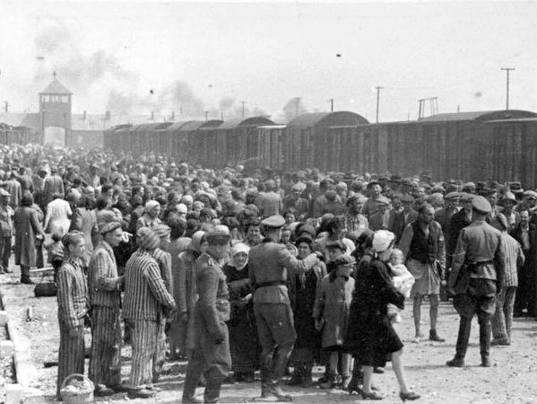

[뒤로가기](https://github.com/GeekInTheClass/WorldWar-II)

# 홀로코스트의 시작 - (1941)

# [홀로코스트의 시작](https://www.youtube.com/watch?v=T96aM9vXOns&index=4&list=PLN1COv79fpSAQJCZQMusbVy2KAcxXNSfc)

## 

**게토에 강제수용 되는 유대인들**
*Drittes Reich In 1941

> 극도의 집단 광기를 보여준, 다시는 일어나선 안 될 비극.
>
> 주된 희생자는 유대인, 집시, 장애인, 동성애자, 또는 나치스를 정치적으로 반대하던 자들이었다. 총 희생자의 수는 흔히 알려진 유대인 600만을 포함한 1100만 정도로 잡는다. 좀 더 넓게 정의할 경우 동부 전선에서 군사작전 중에 죽은 민간인을 제외한 나치 점령지에서 정책적으로 학살당한 소련인까지 포함해 1700만까지 잡는 경우도 있다.
>
> 여타 학살과 구분되는 몇 가지 특이점이 있다. 인류 역사상 학살은 어디를 가나 항상 존재했다. 그러나 이전까지의 학살과 매우 확연하게 구분되는 점은, 전쟁터에서 우발적으로 벌어지는 포로 학살이 아닌, 자국 내 민간인을 대상으로 한 매우 체계적이고 산업적인 방식의 학살이라는 것.
>
> 사실 홀로코스트라는 건 아돌프 히틀러 혼자만의 작품은 아니다. 제3제국의 인종정책의 의미는 사실 땅을 점령해서 독일인에게 배분하겠다는 소리다. 그렇다면 결국 "그 영토에 사는 사람들은 독일인이어야 했다"는 논리적 문제가 생기는 거다. 즉, 슬라브인이나 폴란드인들을 그 땅에서 추방하거나 잡아 죽이고 그 땅을 독일인에게 준다는 개념을 생각해 낸 것이 특징 아닌 특징이다.
>
> 게다가 어찌보면 이 학살의 과정은 그냥 자기가 국민으로삼은데는 후하고 아닌 놈들에겐 더없이 가혹했을 배타주의적 상징으로 시작된 거라고 보면 되지만, 유대인 학살의경우를 예로 들어 보면 그 유대인들이 소유한 경제권과 상권, 자금을 독일인들에게 돌려준다는 개념으로 시작된 것으로 실제로 살던 집 빼앗아서 독일인에게 줘 버리는 등의 행동을 서슴없이 저질렀다.
>
> 헌데 문제가 이런 행동을 하게 되면 생기기는게 유대인들이 미국으로 날라 버리거나 재산 챙겨서 3국으로 도주하는 등의 사태가 생기면 골치 아파지므로 아예 그냥 스케일이 매우 거대한 강도질을 해 버린 거라고 보면 된다.
>
> 즉, 히틀러의 문제는 아리아계 독일인만 국민으로 생각하고 나머지는 폐품 취급했다는 점이다. 게다가 애초에 나치당 성격상 극좌와 극우가 섞여 있어서 생긴 상승작용도 한몫한 것도 있다.
>
> 웃긴 사실은 나치당의 간부들 가운데에 그들이 말하는 "순혈 아리아인" 의 조건에 만족하는 사람은 극히 드물었다는 것이다. 나치당에서 추구하는 우월한 아리아인이란, 금발에 벽안, 그리고 건강한 신체와 운동능력, 뚱뚱하지도 않고, 너무 마르지도 않아야 하며, 웬만하면 시력도 좋아서 안경을 끼지도 않아야 한다"였는데...
> 
> **아돌프 히틀러** - 벽안이었지만 흑발이었다(어린시절엔 금발벽안 이었으나 성장한뒤 흑발로 바뀜). 애시당초 명예 아리아인이라는 개념을 만든 이유가 본인때문. 20세기 초반의 인종구분으로는 오스트리아계 독일인은 알프스 민족(Alpine Race)라 하여 아리아인이긴한데 뭔가 순혈은 아니고....라는 요상한 분류였고 이는 제3제국의 수장에겐 치명적 약점으로 작용했다.
> 
> **파울 요제프 괴벨스** - 흑발인 것도 모자라, 소아마비 장애인이였으며, 굉장히 말랐다.
>
> **헤르만 괴링** - 벽안인 것은 맞으나 갈색 머리였고, 심각한 비만이였다.
>
> **하인리히 힘러** - 흑발에 갈색안이였고, 얼굴의 생김새가 심각하게 동양인적였으며 농담이 아니라 도조 히데키랑 똑같이 생겼다, 안경도 꼈다.
> 
> **루돌프 헤스** - 흑안에 흑발이였다.
>
> **마르틴 보어만** - 벽안이긴 했으나 흑발이였고, 비만이였다.
>
> 당장 국가원수인 히틀러부터가 아리아인 기준에 미달이였고, 저렇게나 많은 고위 간부들이 아리아인으로 실격점이였다. 저것도 극히 일부만 소개하였을 뿐, 실제로는 훨씬 더 많은 나치당 간부들이 아리아인 기준점에 실격이였으며, 라인하르트 하이드리히나 요아힘 폰 리벤트로프 정도만이 아리아인 기준에 얼추 맞아떨어질 뿐이였다.
>
> 또한 히틀러는 어찌 보면 "뭉뚱그린 개념"을 구상한 것에 지나지 않지만, 실행자 측에서 과다 경쟁이 붙어서 효과적인 학살방식과 학살정책을 내놓은 셈이다. 즉, 실제로 대부분의 문제는 하인리히 힘러와 괴벨스, 아돌프 아이히만 등의 작품이다.
>
> 뒤집어 말하면 이는 총통의 망상을 구체화시킨 셈이 되고. 게다가 이건 전쟁에 의한 과열 양상도 한몫한다. 요는 폴란드 등을 침공한 다음에 그 국가에 살고 있는 독일계 주민을 선동해서 폴란드인들을 학대하게 하고 그로 인해서 물자징발을 통해 전쟁 수행 능력을 보충하는 식으로 조성된 일종의 체계화된 약탈체제를 구상한 것이기도 하다. 이 경우 이민족은 가혹하게 수탈해도 되지만 상대적으로 독일인을 삥뜯지 않아도 된다는 개념이 대두되는 셈이니...일단 인종주의는 명분이고 그 안에서 실리를 취득하려고 한 거다. 뭐 간단히 말해 명분있는 약탈 강도 살인 정도 된다고 볼 수 있다.
>
> 그리고 장애인, 집시, 동성애자를 학살한 부분은 대략 이런 구도다.
>
> 먼저 장애인의 경우 나치당은 이들에 대한 과도한 복지정책 등에 대해서 상당히 회의적이었다. 즉 장애인들에 대한 복지 등으로 낭비되는 재원 등을 고려하면 이것은 사회적 병폐와 나약함을 키운다고 생각했던 거다. 즉, 나치당은 장애인을 도태하면 그들의 공동체가 건강해 진다는 해괴한 발상을 가졌던 거다.
>
> 집시의 경우 유대인과 비슷하지만, 집시에 대한 관점은 좀더 전통적인 개념에서 기인한다. 즉, 유대인들의 경우는 극좌화된 성격을 가졌던 이들의 일종의 "부르주아" 계층에 대한 증오의 성격이 있었다면, 집시에 대한 개념은 거의 극우적 발상에서 나온 것이라고 보면 된다.
>
> 동성애자들은 대략적으로 "전통윤리적" 개념을 가지고 이뤄진 학살이라고 보면 된다. 위의 장애인과 마찬가지로 나치당의 개념은 우생학적으로 우월한 아리안 인종을 번식하는 개념으로 정리되는데, 동성애자들은 당연히도 "번식" 자체의 행위를 기피하는 부도덕으로 본 거다.
>
> 게다가 이 당시는 아직 동성애를 정서질환으로만 봤었고, 의학적 발전이 수반되지 않아서 "치료할 수 없는 장애" 정도로 봤다고 볼수 있다.
>
> 즉, 사실은 유대인들에 대한 나치의 학살이 개념구분되는 이유는 자본가에 대한 증오를 매개로 한 반면성이 있었기 때문이다. 허나 심각한 아이러니는 외려 나치당원이라는 사람들중 프롤레타리아 계층이 거의 없었다는 점이다. 즉, 극좌적 발상으로 유대 자본가에 대한 증오를 표출하는 개념을 수반하긴 했지만, 반대로 실상을 보면 이건 부르주아 계층이 같은 부르주아 계층을 좌파 논리로 디스했던 개념과 연관성이 생긴다.
> 이러한 모호하고 모순적인 증오에 대해 '좌파 반유대주의자는 유대인 자본가에 대한 증오 때문에 유대인을 증오하고, 우파 반유대주의자는 유대인 혁명가에 대한 증오로 유대인을 증오한다'는 표현이 유명하다. 이에 대해서 명확히 이해하려면 근대의 유럽에서 도시 시민(부르주아) 계층은 자본가의 산실인 동시에 지식인 혁명가의 모태이기도 했다는 점에 주의해야 한다. 근대로 이행하는 과정에서 급속한 공업화로 농촌 공동체가 해체되고 도시로 인구와 사회적 영향력이 집중되었고, 도시 시민들이 새로운 사회의 주도 세력으로 떠오르게 된 것. 말하자면, 기존의 농업 지주를 대신하여 도시의 공업, 금융자본가들이 경제적 주도권을 쥐게 되었고, 도시화된 시민사회 내에서 고등교육을 받은 지식인들이 영향력을 넓히게 된 것. 그런데, 유대인들의 경우 토지 소유에 제약을 받는 경우가 많고 배타적인 농촌 공동체에 편입하기는 어려웠기에 이전 시대부터 도시에 자리잡고 사는 이들이 많았고, 따라서 도시 시민이 사회의 주도권을 가지게 되면서 유대인들의 사회적 영향력 역시 성장했던 것이다. 즉, 유대인들에 대한 혐오 자체는 중세 이전부터 이어져 내려온 것이고, 이러한 혐오가 부르주아(원문 그대로의 의미로써 부르주아, 즉 도시 거주 시민) 계급이 성장하여 사회적 주도권을 장악하면서 '유대인들이 사회를 장악하고 사악한 음모를 꾸민다'는 망상의 형태로 다듬어진 것.
>
> 즉, 유대인과 집시/장애인/동성애자들과의 개념적인 구분은 약간 다르다.
>
> 이에 대해 라울 힐베르그의 "홀로코스트 유럽 유대인의 파괴"라는 책을 증거로 "홀로코스트가 본격화 되기 이전인 30년대 말 괴벨스의 선동으로 벌어진 유대인에 대한 무차별적인 폭력 행위 조차도 독일 경제에 큰 타격을 주었다고 했으며. 즉 홀로코스트는 물론이고 그보다 훨씬 더 덜 조직적이고 심지어는 온건해 보이기까지 하는 유대인에 대한 폭력조차도 독일 경제에는 이로울 것이 전혀 없었다"고 반박하는 사람들도 있고, 또한 "토지를 차지하기 위한 학살과도 그 궤를 달리하며, 경제 활동의 기반이 되는 "토지"를 가장 적은 비용으로 차지하기 위해 그 토지의 기존 거주자들을 학살하는 것인데 이는 결국 학살이 하나의 수단임을 의미하는데, 하지만 홀로코스트는 확실히 학살 그 자체가 목적인 행위였다"고 반론하는 사람들도 있다. 이에 대해선 햇갈리지 말아야할 부분이 있다.
>
> 나치의 경제계획은 국유화를 통하여 통제경제적인 방향을 조장하여 전시대비에는 어느정도 성과는 있었다고 해야겠지만, 결론적으로 실패한 경제정책인 것은 사실이다.
>
> 여기에 반론하는 사람이 말하는 것은 "결과"지만 당시 나치정권 자체는 그 "결과"에 대해서 몰랐다(...). 즉, 유대인들이 경제권을 가지고 있다(뭐 로스차일드 같은 경우를 보면 어느정도는 맞는 소리긴 하지만)는 일종의 환상 때문에 그걸 다시 "독일인에게 빼앗아 주면"된다고 생각한 문제인 거다.
>
> 또한 후자의 경우 토지에 대한 명분을 가진 인종주의적 학살이라고 보시면 된다. 즉, 홀로코스트가 학살 그 자체가 목적이었다고 보이는 이유는 그 수단을 종합적으로 써먹었기 때문이라고 생각하시면 된다.
>
> 뒤집어 말하면 그 안에도 영토 획득을 하면서 벌어진 인종주의적 관점의 학살행위와, 인종 그 자체를 학살하던 행위라는 점으로 나눠 볼수 있다는 것을 생각해야 겠다.
>
> 게다가 여기에 대해서는 다른 자세한 설명이 필요 없을 것이다. 나치는 애초에 "우월한 아리아인종"의 씨를 받겠다고 일종의 짝짓기를 시켜먹은 전례도 있을 정도였으니까.
> 또한 프로파간다의 성격상 나치당의 정책 자체를 손바닥 뒤집듯 뒤집을수도 없었을 뿐더러 당내의 좌파적 성격을 지닌 SA출신 집단 등의 계보를 생각해 보면 당연하지만 뭔가 증오의 타겟이 필요했던 것이 사실이다. 따라서 유대인이 특별했던 거다.
> 물론 후대의 학자들은 이에 대해서 "독일이 유대인들을 탄압한 것 자체가 경제에 좋지 않은 영향을 미쳤으므로 경제적 이유로 유대인 학살의 이유는 없었다"는 결과론적 관점을 제시할수는 있지만, 애초에 실패한 경제정책의 경우 그것이 실패할줄 알고 저지르는 예는 얼마 없다.

## 관련 어록

> **라인강을 건너 독일에 들어서자 갑자기 중세시대에 온 것 같았다. 나는 20세기 대명천지에 그 잔혹한 범죄들이 어떻게 외부에 알려지지 않았는지 도저히 이해할 수 없었다.**
>
> \- 어느 미군병사의 증언

> **여자들과 노인들이 거리에서 깡패들에게 두들겨 맞았다. 내 눈에서 눈물이 흐른다. 우리에겐 아무 힘이 없고 길거리에서 우리 편을 들어주는 사람이 아무도 없을 만큼 우리는 고독하다. 우리는 너무나 약하다.**
>
> \- 폴란드 유대인의 회상 

> "유태인들은 하나의 인종인 것은 틀림없으나 인간은 아니다" 
>
> \- 아돌프 히틀러

> 인종적 오염을 거부하는 국가가 세계를 지배할 것이다.
>
> \- 나의 투쟁

> **나는 불과 몇시간만에 바뀌었다. 지금까지 내가 사랑했던 이 나라와 이곳 사람들이 갑자기 적으로 돌변했다. 나는 더 이상 독일인이 아니였고 독일인이 될 권리조차 없다, 한때나마 이 나라에 속해있었다는 사실이 부끄럽다, 이곳 사람들에게 품고 있던 믿음이 부끄럽다, 그들은 가면을 집어던지고 잔인한 적의 얼굴을 드러냈다.** 
>
> \- 에드빈 란다우

> 근처에 수용소가 있다는 건 알고 있었죠. 하지만, 너무나도 잘 위장해놔서 그런 일이 있었는 줄은 전혀 몰랐어요. 저도 저기 바로 밑에 마을에 살고 있었지만 하나도 몰랐거든요.
>
> \- 신원미상의 독일인

> 우리는 마을 사람들을 불러모아서 무덤을 파게 했다. **그 독일인들도 모두 거기에 묻어버리고 싶었지만 억지로 참았다.** 바로 코앞에 있었는데도 자기들은 정말 모르는 일이라고 빡빡 우기길래 **나는 당신들도 똑같은 살인마라고 소리쳐줬다.**
>
> \- 미 육군 레슬리 브라운 병장

> **“캠프에서의 첫날밤은 절대로 잊지 못한다. 나의 인생을 긴 밤으로 물들여버린 그날, 일곱번 저주하고 일곱번 회개했다...나의 신을 죽이고, 나의 영혼을 짓밟고, 내 꿈을 먼지로 만들어버린 그날밤을 잊지 못한다. 절대로 이것들을 잊지 않을 것이다. 설령 내가 신만큼 오래 산다고 해도.”**
>
> \- 엘리 비젤, 노벨평화상 수상자

> 이미 일어난 사건은 바꿀 수 없다. 단 우리가 해야 할 일은 역사를 통해 배우고 **무고한 사람들을 박해하는 것이 어떤 결과를 가져오는지를 깨닫는 것**이다.
>
> \- 홀로코스트 생존자이자 안네 프랑크의 아버지, 오토 프랑크

